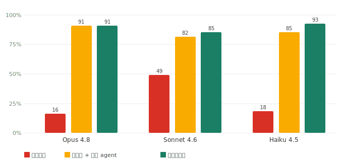
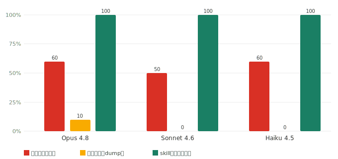
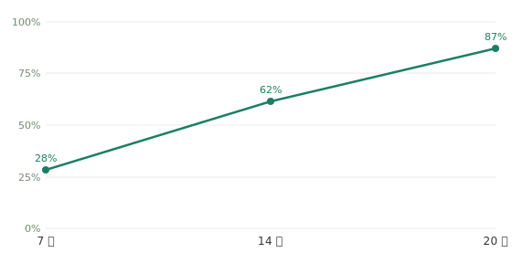
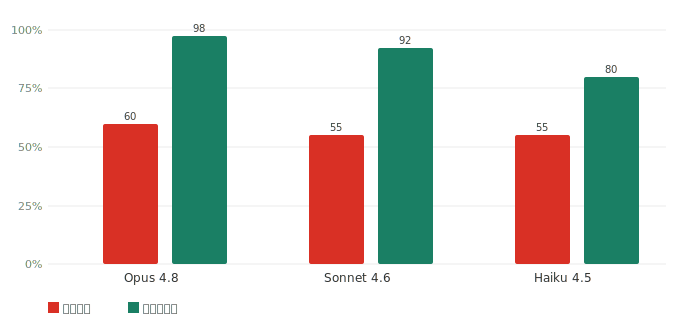
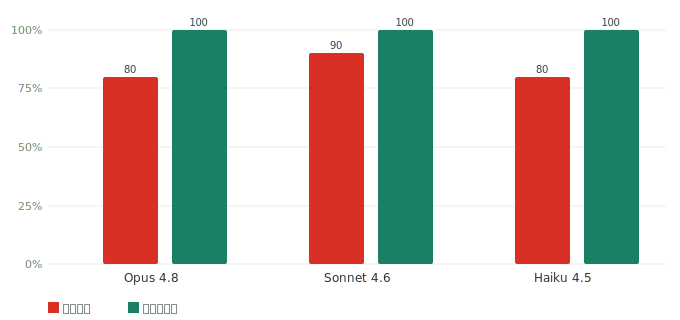

# 🎓 通用期末考试 1天极速备考智能教练 (Universal Exam Cram Coach - LLM Wiki Edition)

[](https://opensource.org/licenses/MIT)
[](#)
[](#)
[](https://github.com/ZeKaiNie/universal-examprep-skill/actions)

这是一个**基于 LLM Wiki 架构**、**全科通用**的期末考试极速备考 AI 智能体技能（Agent Skill）。

只要将本技能导入支持的智能体（如 VS Code 智能体插件、Claude Code、Codex、Cursor、Windsurf、Devin 或网页版 GPTs/Gemini），并提供你想要复习的科目资料，智能体就会化身你的**物理防幻觉私人专属备考教练**，带你在 1 天内突击通关。

> 📜 完整版本沿革见 [CHANGELOG.md](CHANGELOG.md)。

---

## 🚀 核心防幻觉与提分能力

针对“明天就要考试、几乎完全没学过、只求通过”这一极限备考场景，本技能提供以下 4 个被实测验证的防幻觉与提分能力：

* **🟢🟡 知识来源标注**：强制 AI 严格区分并标注 wiki 章节与答案的来源。如果是来自学生上传的课件/重点，标注“🟢 来自资料”；如果是 AI 自己脑补的背景知识，强制显著标注“🟡 AI补充，可能与你老师讲的不完全一致”；如果是 AI 自动为重点题生成的参考答案，强制标注“⚠️ AI生成答案，非老师/教材提供”，绝不欺骗学生。
* **📚 重点题「七步讲解模板」**：精讲重点题走固定七步：① 题面图 → ② 这题在问什么 → ③ 图里要读的量 → ④ 核心公式 → ⑤ 逐步演算 → ⑥ 答案自检 → ⑦ 知识点溯源（章节 + wiki + 可点击原文页链接），每题固定输出一行来源块 `题目来源：…｜答案来源：…｜🟢/🟡/⚠️`，默认到此为止（【易错点】/【3分钟速记口诀】按需输出，含文科变体）。零基础学生对老师勾的每道重点题逐题走此模板，目标是能在考场上直接默写框架拿分。
* **📊 画图题先跑算法再画 (`type: "diagram"`)**：针对二叉树旋转、图遍历、状态机等画图题目，禁止 AI 凭空脑补想象最终图像。强制 AI “先在后台写 Python 代码运行标准算法 -> 自动求得正确拓扑结构 -> 渲染并输出实体图片”，确保作图 100% 精准，并优先遵循老师的画图流派。
* **🧩 6 大试题题型支持**：题库题型从原本的 {选择题、主观题} 扩展支持 `{选择、主观、画图、填空、判断、代码}` 等 6 大经典期末考试题型，更贴合高校真实考卷结构。

---

## 🏗️ 工程化重构 (Engineering Restructuring)

项目还完成了一次大规模的工程化重构（[PR #11](https://github.com/ZeKaiNie/universal-examprep-skill/pull/11)），不改变任何既有行为，专注于可移植性、可维护性和测试基础设施：

* **🧩 模块化技能集合**：将单体 `SKILL.md` 拆分为 `skills/` 下的 9 个单一职责子技能（`exam-cram` 主协调器 + `exam-ingest` / `exam-tutor` / `exam-quiz` / `exam-review` / `exam-cheatsheet` / `exam-audit` / `exam-help` + `confusion-tracker` 疑难追踪），便于不同 agent 按需加载。根目录 `SKILL.md` 仍为默认兼容入口，不影响已安装用户。
* **📄 AGENTS.md 通用代理兜底**：新增一屏浓缩的防幻觉核心契约，供 Codex、Cursor 规则、Antigravity 等不读完整 SKILL.md 的通用代理使用。
* **🌐 双语控制层**：英文控制指令（精确、可测）+ 简体中文学生可见输出，统一来源标注 canonical 用词（🟢/🟡/⚠️），避免多入口措辞不一致。语言策略详见 [`docs/language-policy.md`](docs/language-policy.md)。
* **🔍 工作区校验器**：新增 [`scripts/validate_workspace.py`](scripts/validate_workspace.py)（纯标准库），可零成本校验已建工作区的结构、题库 schema、来源标注和路径安全。
* **🔬 测试覆盖大幅扩展**：覆盖 ingest、工作区校验、技能结构完整性、语言策略一致性、控制层双语等维度的 stdlib 单元测试套件（数量随测试增减，运行 `python -m unittest discover -s tests -v` 查看当前值）。CI 矩阵覆盖 Ubuntu/Python 3.8 + 3.12 + Windows。
* **📚 架构文档补全**：新增 [`docs/skill-architecture.md`](docs/skill-architecture.md)（技能集合结构）、[`docs/agent-portability.md`](docs/agent-portability.md)（不同代理加载方式）、[`docs/file-format.md`](docs/file-format.md)（工作区文件格式规范）。

---

## ⚙️ 核心运行机制 (Core Mechanics)

* **⚡ LLM Wiki 目录结构化加载**：丢弃了原先庞大且容易撑爆上下文的单个 Markdown 答案文件。升级为按章节/阶段的 Wiki 物理切片（`references/wiki/`），Agent 会根据复习进度 **Lazy Load (惰性加载)** 对应章节，**Token 消耗直降 90%**，长对话不再卡顿。
* **🛠️ 一键无缝冷启动**：告别了手动建立题库与 Markdown 文件的繁琐操作。**学生完全不需要理会复杂的 JSON 格式**，只需提供大纲或真题，Agent 将在后台自动解析大纲、拼装 JSON 并通过脚本完成 Wiki 物理切片的切割与进度初始化。
* **🔌 无 Python 环境自动降级**：内置降级执行能力。即使学生电脑里没有安装 Python，Agent 也会无缝切换为“手动写入模式”，利用自身的文件写入功能直接在本地铺设 Wiki 目录，**100% 免配置、零摩擦运行**。
* **🎯 标准真题库 quiz_bank.json 抽题**：测试题由“AI 即兴编造”升级为“标准真题库抽测”，规避了 AI 出无解错题、弱智题的毛病。
* **🖼️ 依赖图的题 fail-closed**：讲义里的 Quiz/Example 常依赖一张图（文氏图、页内插图、表格）。题库项可附原页引用与图片资源（`source_pages` / `assets` / `requires_assets`），校验器会在“需要图却没附图”时报错，出题时也**绝不在不显示该图的情况下出这道题**——避免给学生一道根本没法答的题。老题库不带这些字段仍然有效。详见 [`docs/file-format.md`](docs/file-format.md) §4。
* **🏃 测试逃生通道 (Hint & Skip)**：针对测试关卡设计了“查看提示”与“2次答错跳过并归档”机制，防止学生因主观题表述差异或卡壳而被死锁在当前阶段。
* **🧠 概念疑难点自动追踪**：内置 `skills/confusion-tracker` 子技能，自动捕获并记录复习过程中的概念疑问（如“为什么/怎么推导”），形成考前盲区扫雷清单。
* **🛡️ 运行安全与进度保护**：引入文件名安全过滤、路径防穿透防篡改、进度覆盖前自动备份，并强制 UTF-8 打印完美解决 Windows 终端中文乱码。
* **🔬 单元测试与 CI 集成**：内置覆盖导入、工作区校验、技能结构、语言策略、控制层双语等维度的 stdlib 单元测试套件，由 GitHub Actions 在云端多平台（Windows & Linux、Python 3.8/3.12）自动运行质量检测。

---

## 防幻觉实测 / Hallucination Benchmark

我们用两门名校公开课做了一次可复现的实测，检验装上这个技能后，模型是否真的更少凭空编造、更愿意承认资料里没有的内容。实测只针对技能本身，与任何平台无关。完整方法、代码与数据在 [`benchmark/`](benchmark/)，中英双语完整报告见 [`benchmark/results/matrix/report.html`](benchmark/results/matrix/report.html)，分步通俗说明见 [`benchmark/docs/测试流程详解.md`](benchmark/docs/测试流程详解.md)。

**怎么测的。** 两门课各出一套带标准答案的题目，让三个模型 Opus 4.8、Sonnet 4.6、Haiku 4.5 在三种条件下作答，再逐题对照标准答案判分。三种条件是：

- 不给资料：模型只能靠自己已有的知识回答。
- 裸文件 + 通用 agent：把原始讲义/习题文件放进一个文件夹，模型用通用的文件读取/检索工具按需查阅，但**不使用本技能**。这是最公平的对照——直接回答“丢个文件夹给 AI 自己读不就行了，还要技能干嘛”。
- 使用本技能：先把讲义整理成分章节的知识库，模型答题时按需取相关章节。

每套题里都掺入了一部分资料中根本没有答案的问题，用来检验模型遇到不会的内容时，是如实回答“资料里没有”，还是硬编一个答案。

（此外还设了一个朴素对照“一股脑全塞”——把整门课全文塞进一次提问；它的问题见正确率表下方脚注。）

**判分如何保证可信。** 判分由 Sonnet 4.6 完成，数值题用程序精确比对，并由人工抽查与判分结果逐题对照。两次独立人工校准都达到高度一致：早先 16 题抽查 Cohen's kappa = 0.875；随后又做了一次 **24 题分层盲测校准**（可答判对/判错 + 越界弃答/未弃答四层，判分对人隐藏），一致率 91.7%、**Cohen's kappa = 0.833**（同属高度一致，互相印证）。两次里观察到的人机分歧**全是判分偏严**（把正确答案判错）——这是抽样迹象（样本有限，不构成对全部判分的证明），提示下面的数字更可能**偏保守而非虚高**；两次独立校准均高度一致，因此可信。

### 一、MIT 6.006 算法

一门数学密集的理工课，共 65 题，其中 55 题有标准答案、10 题资料中没有答案。

正确率，越高越好：

| 模型 | 不给资料 | 裸文件 + 通用 agent | 使用本技能 |
|---|:--:|:--:|:--:|
| Opus 4.8 | 16% | 91% | 91% |
| Sonnet 4.6 | 49% | 82% | 85% |
| Haiku 4.5 | 18% | 85% | 93% |

一个能按需读文件的通用 agent 本身就已经很强（82%–91%），远高于不给资料。使用本技能再高 0–8 个百分点，且**对越弱的模型帮助越大**（Haiku 上 85% → 93%）。



平均每题成本——这是本技能真正的差异：同等甚至更高精度下更省。

| | 不给资料 | 裸文件 + 通用 agent | 使用本技能 |
|---|:--:|:--:|:--:|
| 每题成本 | $0.037 | $0.079 | $0.067 |

本技能每题约 $0.067，比裸文件 agent 的 $0.079 更省——它只取压缩过的相关章节，而裸文件 agent 每题都要翻检整堆原始文件。

资料中没有答案时，如实回答“资料里没有”的比例，越高越好。这是衡量会不会硬编的最直接指标：

| 模型 | 不给资料 | 裸文件 + 通用 agent | 使用本技能 |
|---|:--:|:--:|:--:|
| Opus 4.8 | 60% | 100% | 100% |
| Sonnet 4.6 | 50% | 100% | 100% |
| Haiku 4.5 | 60% | 100% | 100% |

裸文件 agent 与本技能都对没有答案的问题 100% 如实承认；不给资料时只有 50%–60%。



> 朴素对照“一股脑全塞”为什么没进上面三栏：把整门课全文塞进一次提问，提问过大常触发用量/读入上限而**根本返回不了答案**（Sonnet 28/55、Haiku 53/55 道没返回）。把没返回的如实算作答错，它的真实正确率只有 **Opus 71% / Sonnet 45% / Haiku 2%**——远低于裸文件 agent 与本技能；只看“侥幸跑通”的题会虚高到 87%/93%/50%，那是幸存者偏差。它每题还最贵（$0.945，约为本技能的 14 倍）。所以“一股脑全塞”是最差选择，只作脚注。

关于编造率，按逐句严格判定：不给资料时为 2%–18%，使用本技能时为 20%–29%。使用本技能时这一项并非最低，原因是严格判定会把“答案正确、但补充了出处段落之外的正确细节”也算作一次编造，这与凭空捏造不同。不给资料时编造率看似更低，是因为它正确率也低，往往只答很少。真正衡量凭空捏造的是上面那一项，使用本技能时为 100%。

知识库越完整，答得越准。把技能的知识库从 7 章逐步补到 14 章、20 章，正确率随之从 28% 升到 62%、再到 87%。这条逐步上升的曲线说明，是知识库的覆盖程度在驱动正确率，而不是别的因素。



### 二、Yale PSYC 110 心理学

一门文科课，共 50 题，其中 40 题有标准答案、10 题资料中没有答案。下表对比“不给资料”与“使用本技能”（三个模型）：

| 模型 | 正确率·不给资料 | 正确率·使用本技能 | 如实承认·不给资料 | 如实承认·使用本技能 |
|---|:--:|:--:|:--:|:--:|
| Opus 4.8 | 60% | 98% | 80% | 100% |
| Sonnet 4.6 | 55% | 92% | 90% | 100% |
| Haiku 4.5 | 55% | 80% | 80% | 100% |





文科课上结论一致：使用本技能后正确率提高 25 到 38 个百分点，对没有答案的问题全部如实承认。在已跑完的 Opus 上，裸文件 agent 也有 95% 正确率（每题 $0.16，仍高于本技能的 $0.10），与 6.006 的发现一致：技能与裸文件 agent 精度接近、但更省。（PSYC 的裸文件 agent 仅 Opus 跑完，Sonnet、Haiku 因用量限制待补。）

**结论**

1. 能按需读文件的通用 agent 本身就很强（6.006 82%–91%、PSYC 的 Opus 95%），远超不给资料。使用本技能再高 0–8 个百分点，且对越弱的模型帮助越大（Haiku 在 6.006 上 85% → 93%）。
2. 本技能真正的差异在成本：同等甚至更高精度下，每题比裸文件 agent 更省（6.006 $0.067 vs $0.079，PSYC $0.10 vs $0.16），因为它只取压缩过的相关章节，而非每题翻检整堆原始文件。
3. 对资料中没有答案的问题，裸文件 agent 与本技能都 100% 如实承认，都完胜不给资料（50%–90%）。
4. 把整门课一股脑塞进提问是最差选择：每题约贵 14 倍，且文本过大会触发用量/读入上限而跑崩。
5. 知识库越完整，正确率越高，且呈逐步上升趋势（28% → 62% → 87%）。

**说明与局限**

- 不夸大：在能读文件的 agent 框架里，本技能对正确率的提升是温和的（0–8 个百分点）；它的主要价值是同精度下更省、对弱模型帮助更大、以及避免“一股脑全塞”的崩溃。
- 判分由单一模型家族 Sonnet 完成，已通过两次人工抽查校准（16 题 kappa = 0.875；24 题分层盲测 kappa = 0.833），均属高度一致，观察到的分歧全为判分偏严（抽样迹象：数字倾向保守）；但判分模型与被测模型同属一个家族，仍是已知局限。校准工具见 [`benchmark/calibrate.py`](benchmark/calibrate.py) 与通用版 [`benchmark/calibrate_matrix.py`](benchmark/calibrate_matrix.py)。
- 编造率采用逐句严格判定，会把正确但有额外展开的回答也计入，因此使用本技能时这一项数值偏高，并不代表凭空捏造增多。
- PSYC 的“裸文件 agent”仅 Opus 跑完，Sonnet、Haiku 因用量限制待补；“一股脑全塞”的报错回答不计分。
- 题量为 6.006 共 65 题、PSYC 110 共 50 题，样本规模有限。各项指标对标 FACTS Grounding、Vectara HHEM、RAGAS、RGB 等公开基准，详见 [`benchmark/docs/`](benchmark/docs/)。

---

## 🧪 工程化校验 (Engineering Validation)

除了上面那套**昂贵**的真实 benchmark，本仓库还有一组**零成本、可频繁跑**的结构化校验，用来在不烧额度的前提下守住质量：

```bash
# Tier 0：单元测试（ingest + 工作区校验器 + 技能结构，纯 stdlib，无网络/无 API key）
python -m unittest discover -s tests -v

# Tier 1：校验一个建好的备考工作区是否符合规范（结构 / 题库 schema / 来源标注 / 路径安全）
python scripts/validate_workspace.py path/to/workspace
```

- 工作区文件格式规范见 [`docs/file-format.md`](docs/file-format.md)；校验器为 [`scripts/validate_workspace.py`](scripts/validate_workspace.py)。
- **完整 benchmark 很贵**（一次单轮矩阵几十美元/几小时，长程漂移测试以天计额度），**不应为每个小改动跑全量**——分层策略见 [`benchmark/docs/test_tiers.md`](benchmark/docs/test_tiers.md)。**CI 实际只跑 Tier 0（单元测试）**；Tier 1 校验器是本地/手动步骤——它的校验逻辑已由 Tier 0 单测在 `tests/fixtures/` 上覆盖，且有确定性 `ingest → validate` 集成测试（真跑两个 CLI，在真实 ingest 产物上）随根测试进 CI。

---

## 📂 技能包目录结构与简明功能说明

这是一个结构完备的备考智能体技能包，包含以下核心文件：

* 📄 **`SKILL.md`**：**【智能体技能核心 / 兼容入口】** —— 承载完整防编题与来源标注规则，Cursor / VS Code / Claude Code / Windsurf 等工具自动读取。已安装的用户无需做任何改动。
* 📄 **`SKILL.en.md`**：**【英文操作手册（派生渲染）】** —— 根 `SKILL.md` 的英文版说明，供英文用户阅读；行为以中文 `SKILL.md` 为事实源，本文件非触发入口（无 frontmatter）。
* 📄 **`AGENTS.md`**：**【通用代理一屏兜底契约】** —— 给不读完整 SKILL.md 的通用代理（Codex、Cursor 规则、Antigravity 等）的防幻觉核心浓缩版。
* 📂 **`skills/`**：**【模块化技能集合】** —— 按职责拆分的可移植子技能，支持技能集合的 host 可用 `skills/exam-cram/SKILL.md` 作主入口。
  * 📂 `exam-cram/`：主协调器（编排四步工作流 + 模式路由）
  * 📂 `exam-ingest/`：从学生材料初始化工作区（wiki + 题库 + 进度）
  * 📂 `exam-tutor/`：按章惰性加载授课（含零基础重点题精讲、画图先跑算法）
  * 📂 `exam-quiz/`：题库抽题判分（6 大题型）
  * 📂 `exam-review/`：错题与概念疑难点复盘
  * 📂 `exam-cheatsheet/`：考前速记小抄生成
  * 📂 `exam-audit/`：只读检查工作区健康度
  * 📂 `exam-help/`：速查卡（一屏看懂工作流 / 模式 / 文件约定）
  * 📂 `confusion-tracker/`：概念疑难点追踪——被 `exam-tutor` / `exam-review` 调用，自动把概念疑惑记录到进度表（已并入 `skills/`，模块化安装时不会再丢）。
* 📂 **`scripts/`**：自动化脚本。
  * 🐍 `build_raw_input_from_workspace.py`：**【官方课程材料入口】** —— 把一文件夹的讲义/作业 **PDF** 扫成 `ingest.py` 用的 `raw_input.json`：保留**原页出处**、把依赖图的页**整页渲染成 PNG asset**、抽取讲义 **Example/Quiz 题—解对**进题库、并产出解析报告。让 AI 不必再手写临时解析脚本而丢图丢题。PDF 文本/渲染为**可选依赖**（文本 `pip install pypdf`；渲染 `pip install pymupdf` 或 `pypdfium2 Pillow`，缺失会清晰报错）；纯 `.txt/.md` 无需依赖。官方流程：`build_raw_input_from_workspace.py → ingest.py → validate_workspace.py`（详见 [`docs/file-format.md`](docs/file-format.md) §4）。
  * 🐍 `ingest.py`：**【一键环境初始化脚本】** —— 由 AI 助手在后台自动调用，负责一键切分 Wiki 章节、题库并部署进度表。
  * 🐍 `validate_workspace.py`：**【工作区校验器】** —— 静态校验已建工作区的结构、题库 schema、来源标注与路径安全（纯标准库，零成本）。
  * 🐍 `build_visual_index.py`：**【通用视觉双索引，召回优先】** —— 分层确定性识别（页内嵌图/矢量对象 → 图号/坐标轴排版 → 多学科中英词面，不绑任何学科）生成 `image_question_index.json`（每题视觉档案 + 按章 总数×requires×maybe×疑漏）与 `figure_page_index.json`（材料视觉页清单），并给出**疑似漏标图依赖题**报告；`--apply` 渲染原页挂题面 asset 并标 `maybe_requires_assets`。配套 `list_image_questions.py` / `list_figure_pages.py` / `show_question_assets.py`（图题统计与题面图展示的官方工具，替代临时脚本）。
* 📂 **`docs/`**：架构与策略文档。
  * 📄 `language-policy.md`：双语语言策略（英文控制层 + 简体中文学生层）与来源标注的唯一权威定义。
  * 📄 `skill-architecture.md`：技能集合结构说明（子技能 ↔ 备考生命周期映射）。
  * 📄 `agent-portability.md`：不同代理的加载方式与支持矩阵。
  * 📄 `file-format.md`：工作区文件格式规范（quiz_bank.json schema、6 大题型字段、来源标注规则）。
  * 📄 `localization.md`：本地化边界——当前学生侧中文模板与控制逻辑同文件、暂不拆 `locales/`，及将来加第二语言时的拆分规则。
* 📂 **`prompts/`**：存放提示词。
  * 📄 `web_prompt.md`：**【网页端一键平替提示词】** —— 专为不支持本地写盘的网页版 AI（ChatGPT / DeepSeek 网页端 / 豆包）准备，复制直接用。
  * 📄 `web_prompt.en.md`：**【英文版网页提示词（派生渲染）】** —— 上者的英文版，默认英文回复（可说「中文」/「双语」切换），锚点与防编题规则同款。
* 📂 **`templates/`**：备考基准模板文件。
  * 📄 `study_plan_template.md`：复习计划表模板。
  * 📄 `study_progress_template.md`：进度追踪与错题打卡表模板。
  * 📄 `quiz_bank_template.json`：真题抽测 JSON 模板。
* 📂 **`tests/`**：【单元测试包】 —— stdlib 自动化测试套件，覆盖 ingest、工作区校验、技能结构、语言策略、控制层双语、技能集合自洽、运行时去版本化等（当前数量见 `python -m unittest discover -s tests -v`）。

---

## 🎯 计算机 0 基础小白快速上手指南

如果你是个从来没写过代码、甚至没听说过编程的文科/理科学生，推荐你使用以下两种极简方式开启复习：

### 方式 1：全自动 AI 托管安装模式 (适合 Claude Code / Cursor / Windsurf / Devin 等)
这是最省心、也是最推荐的方案。你可以把所有的文件摆放、下载以及配置工作全部交由 AI 帮你在后台做完：

1. **新建你的复习文件夹**：在你的电脑上新建一个普通的空文件夹，命名为你的学科名字（比如叫 `计算机组成原理复习`），并用你的 AI 软件（如 Cursor 或终端里的 Claude Code）打开这个文件夹。
2. **一键全自动安装技能 (Prompt 1)**：在 AI 聊天对话框中，直接复制发送以下指令给 AI：
   > **“帮我在当前目录下创建 `.claude/skills/` 文件夹，并把 GitHub 仓库 `https://github.com/ZeKaiNie/universal-examprep-skill` 克隆到 `.claude/skills/universal-exam-cram-coach/`，完成技能的本地安装。”**
   * *AI 行为：AI 助手会在后台默默下载并新建隐藏目录，完全不需要你手动拖拽文件。*
   * *📌 路径说明：Claude Code 读取技能的位置是 `~/.claude/skills/` 或项目内 `.claude/skills/`；而 `.agents/skills/` 是 Codex / Cursor 的约定，Claude Code 不会扫描该路径。请按你实际使用的工具选择对应目录。*
   * *⚠️ 重要：核心技能集合与概念疑难点追踪（`confusion-tracker`）现已全部并入 `skills/`，疑难点追踪不再是 `skills/` 之外的外部依赖。但仍请克隆**整个仓库**——`exam-ingest` 依赖根目录的 `scripts/` 与 `templates/`，`docs/` 与网页提示词 `prompts/` 也在 `skills/` 之外，只复制 `skills/` 仍会缺这些。*
3. **一键初始化并开始复习 (Prompt 2)**：安装成功后，直接上传你的复习大纲或重点图片，发送：
   > **“这是我的【马原】复习大纲，请遵循刚才安装的 `universal-exam-cram-coach` 技能，在后台解析大纲并自动初始化我的备考 Wiki 空间。”**
   * *AI 行为：AI 将自动大纲解析、完成 Wiki 物理切片和进度计划生成。你只需要跟着 AI 的节奏答题复习即可！*

> **📌 多入口说明**：本技能提供多个入口文件适配不同代理——根 `SKILL.md`（默认兼容入口）、`skills/exam-cram/SKILL.md`（模块化主入口，与根 SKILL.md 描述同一行为）、`AGENTS.md`（一屏兜底契约）；英文用户另有派生英文面 `SKILL.en.md` / `prompts/web_prompt.en.md`（行为以中文文件为准）。详见 [`docs/agent-portability.md`](docs/agent-portability.md)。

---

### 方式 2：对话式网页 AI 一键平替模式 (适合 ChatGPT / DeepSeek / 网页版 Claude / 豆包等)
如果你的 AI 只是普通的网页聊天对话框，无法直接修改你电脑上的本地文件，请使用本方式：

1. **第一步：复制超级提示词**：直接打开本仓库下的 [prompts/web_prompt.md](prompts/web_prompt.md)，一键复制里面所有的超级提示词。
2. **第二步：发送提示词与大纲**：把这段提示词发给网页 AI（如 ChatGPT 或 DeepSeek 网页版），接着把你的教材、大纲或重点内容作为附件或文字发送给它。
3. **第三步：开始互动复习**：AI 会在聊天中直接吐出计划，并在每次回复底部附带一个“进度打卡面板”，直接根据 AI 的指引互动复习即可。

---

## 💻 智能助手软件兼容性矩阵

本技能在各大主流 AI 开发软件中的运行效果如下（详细加载方式见 [`docs/agent-portability.md`](docs/agent-portability.md)）：

| AI 客户端 | 加载层级 | 读取的入口文件 | 物理文件锁定 | Python 脚本 | 使用方式 |
| :--- | :---: | :--- | :---: | :---: | :--- |
| **Claude Code** | 技能层 | 根 `SKILL.md` 或 `skills/*` | ⭐⭐⭐⭐⭐ | ⭐⭐⭐⭐⭐ | 项目内 `.claude/skills/` 或全局 `~/.claude/skills/` 安装，完美支持文件写盘与脚本执行。 |
| **Cursor / VS Code / Windsurf** | 指令层 | `AGENTS.md`（或未来项目规则） | ⭐⭐⭐⭐⭐ | ⭐⭐⭐⭐⭐ | AI 在侧边栏直接写盘，文件结构清晰可见。`AGENTS.md` 作防幻觉规则兜底。 |
| **Codex** | 技能/指令层 | `AGENTS.md` / `skills/*` | ⭐⭐⭐⭐⭐ | ⭐⭐⭐⭐⭐ | `AGENTS.md` 作指令兜底，或作为技能包加载 `skills/`。 |
| **Devin / Antigravity** | 技能/指令层 | `AGENTS.md` / `skills/*` | ⭐⭐⭐⭐⭐ | ⭐⭐⭐⭐⭐ | 自主文件修改与工具执行权限强，克隆项目、运行脚本极快。 |
| **网页端 AI (ChatGPT / Claude / Gemini / 豆包等)** | 提示词 | [`prompts/web_prompt.md`](prompts/web_prompt.md)（英文版 [`prompts/web_prompt.en.md`](prompts/web_prompt.en.md)） | ⭐⭐☆☆☆ | ❌ | 网页端无法修改本地文件。**强烈推荐直接复制使用网页端平替备考提示词**，已含来源标注与防编题规则。 |
| **其他通用代理** | 指令层 | `AGENTS.md` | 视 host | 视 host | 一屏浓缩兜底契约，适配任意支持项目规则/指令的代理。 |

---

## ❓ 常见问题与故障排除

* **Q：我的电脑没有安装 Python，或者报错“python 不是内部或外部命令”怎么办？**
  * **A**：**完全不用担心！** 本技能内置无 Python 环境的自动降级机制。当 Agent 在执行脚本发现你的电脑没有 Python 环境时，它会**自动且静默地切换为“手动写盘模式”**——由 AI 自己直接在本地创建 Wiki 目录并拼写章节文件。用户不会感受到任何差别，依然能够顺利开始复习。
* **Q：如果我的 Claude Code / Codex 接入的是纯文本 API（如 DeepSeek，没有多模态视觉），但老师给的重点是照片或 PDF 扫描件，可以使用本技能吗？**
  * **A**：**完全可以！** 备考教练的核心授课和测验逻辑是 100% 纯文本的。在初始导入阶段，你只需多花 2 分钟进行一次“文本化中转”即可：
    1. **多模态转录**：把拍的照片或 PDF 扫描件发给任意一个**免费的网页版多模态 AI**（如 ChatGPT 网页版、Gemini、Kimi、豆包、通义千问），发送指令：
       > *「帮我把这些照片里老师勾画的重点内容和题目提取出来，按章节整理成纯文字，保留老师标注的重点标记（如星号、重点符号）。」*
    2. **获取文字**：复制网页端 AI 秒级输出的整理纯文字。
    3. **本地建库**：在本地工作区新建一个文本文件（如 `notes.txt`）并将文字粘贴进去。然后对本地 Agent（Claude Code / Codex）说：
       > *「读取 `notes.txt` 中的重点，遵循 `universal-exam-cram-coach` 技能的 `exam-ingest` 步骤，在后台自动完成建库。」*
    4. **后续运行**：建库完成后，纯文本的 DeepSeek 即可无缝接管后续的 **按章授课 → 刷题测验 → 错题复盘** 全流程，体验丝滑且完全不受无视觉能力限制。
* **Q：为什么测试题总是卡在一道题过不去？**
  * **A**：主观计算题/简答题如果学生答案不够精确，可能会被误判。您可以直接在对话中对 AI 说：“**这道题太难了/这道题我想直接跳过**”。AI 会将该题自动归档至你的 `study_progress.md` 错题本中，直接放行，让你在最后一个阶段统一重温。
* **Q：我们老师最后一次课只口头划了重点，我手里只有录音/录像，没有大纲文件怎么办？**
  * **A**：完全不用担心，你可以选择以下 **3 种“录音速通姿势”** 将其喂给备考教练：
    1. **姿势一：AI 客户端中转（最通用）**：把录音文件先丢给其他专门的语音转录 AI 客户端（如飞书妙记、通义听悟、剪映、微信语音转文字等）生成整段文本，再将转好的文本发给备考智能体。
    2. **姿势二：音频直传（最省心，适合支持音频的 AI）**：如果你使用的 AI 客户端原生支持音频分析（如基于 Google Gemini 体系的 **Antigravity** 平台，或网页版 Gemini Advanced），你可以直接把录音文件（.mp3/.m4a）拷贝到工作区，对 AI 说：*“帮我听一下我工作区里的 focus.mp3，并初始化备考空间”*。
    3. **姿势三：手机端实时听写（最直接）**：在最后一节课上，直接使用手机录音自带的“语音转文字/实时听写”功能，把老师划重点的话实时转成文本，复习时直接把整段口语化文本发送给 AI。AI 具备极强的模糊纠错能力，能自动过滤废话并精准提取考点。

---

## 📝 开源协议
本项目基于 **MIT License** 协议开源。欢迎大家提交 Pull Request 贡献更多科目的复习模板或辅助脚本！

**祝所有临考冲刺的学生考神附体，高分通关！🎓🔥**
