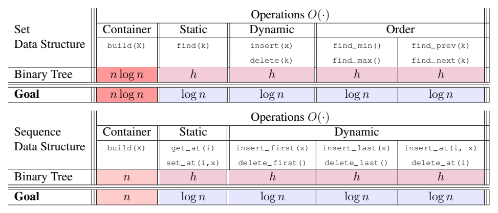
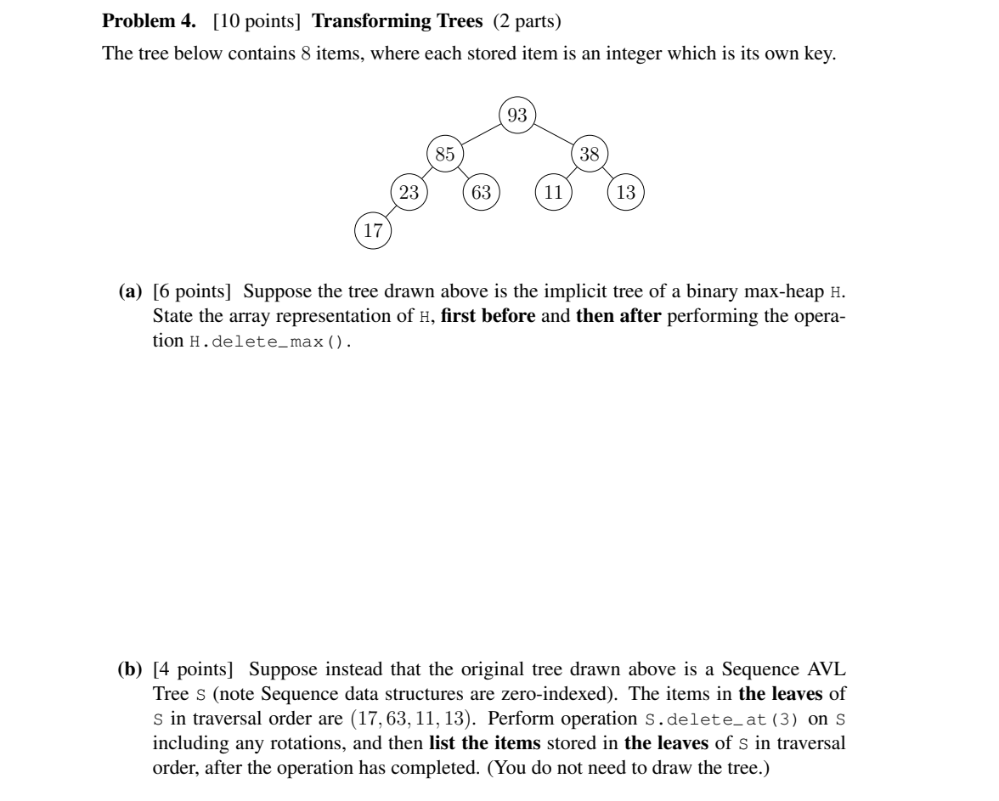

<div align="center">


# Exam Cram Coach · Flash

*Drop your course folder on a coding agent. Get a tutor that teaches from your own slides, shows the figures, quizzes you with your own homework, and remembers where you stopped.*

English · [中文](README.zh.md)

[](https://github.com/ZeKaiNie/universal-examprep-skill/stargazers)
[](https://github.com/ZeKaiNie/universal-examprep-skill/releases/latest)
[](LICENSE)
[](https://github.com/ZeKaiNie/universal-examprep-skill/actions)

**One command to set up · Teaches from your files · Shows the figures · Quizzes from your homework · Never hides what it made up**

</div>

Exam Cram Coach is an [Agent Skill](SKILL.md) plus one small Python tool. You give a coding agent (Claude Code, Codex, Cursor, Windsurf, Antigravity, Gemini CLI, …) the folder with your lecture slides, notes, homework and past papers. From then on it:

- reads PDF / PPTX / DOCX / Markdown / TXT / HTML and splits the course into chapters;
- **cuts the figures out of the lecture notes and the printed questions and solutions**, so it can put the right picture in front of you while it explains;
- pulls the real questions and reference answers out of homework and exams (it matches `hw2.pdf` with `hw2solutions.pdf`, and “Problem 1.3.10” with its solution);
- teaches one chapter at a time, in plain words, citing `file p.N` for every fact;
- quizzes you only with those questions, keeps your mistakes and notes, and builds a cheat sheet;
- labels every sentence so you always know where it came from:

| Label | Meaning |
|---|---|
| 🟢 **From your materials** | traceable to a file and page |
| 🟡 **AI supplement** | background the agent added; may differ from what your teacher taught |
| ⚠️ **AI-generated answer** | the materials contain no answer; this one is the agent's own |

**Flash** is the name of this edition: setup takes seconds even for a whole course, the whole skill is about 1,100 words, the study loop is seven commands, and it works with small models (tested with Gemini flash-lite and Claude Haiku). The earlier “full” edition (v4.3, with HTML/PDF study guides and a heavyweight verification pipeline) is still available from the [v4.3 release](https://github.com/ZeKaiNie/universal-examprep-skill/releases/tag/v4.3); see [Flash vs. the old full edition](#flash-vs-the-old-full-edition).

## Contents

1. [Start studying in five minutes](#start-studying-in-five-minutes)
2. [What a study session looks like](#what-a-study-session-looks-like)
3. [Preparing your materials](#preparing-your-materials)
4. [Flash vs. the old full edition](#flash-vs-the-old-full-edition)
5. [What ends up in the `exam-cram/` folder](#what-ends-up-in-the-exam-cram-folder)
6. [Command reference](#command-reference)
7. [Measured results](#measured-results)
8. [FAQ](#faq)
9. [For developers](#for-developers)

## Start studying in five minutes

### Step 0 · What you need

- **A coding agent with a terminal**: Claude Code, Codex, Cursor, Windsurf, Antigravity, Gemini CLI, or any other agent that can run shell commands and read files. For PDF-heavy courses prefer the desktop app or IDE version of your agent: terminals often cannot display the figures.
- **Python 3.8 or newer.** Check with `python --version`. On Windows, install it from [python.org](https://www.python.org/downloads/) and tick *Add python.exe to PATH*.
- Optional but recommended: `pip install pypdfium2`. It gives PDF text extraction and figure cropping. Without it, PDFs are listed as “needs pypdfium2” and everything else (PPTX, DOCX, Markdown, TXT) still works.

### Step 1 · Install the skill

**Easiest: let the agent do it.** Copy this to your agent; it may ask you to approve network access or writing to its skills folder:

```text
Install the Exam Cram Coach skill: download exam-cram-coach-flash.zip from the latest release at https://github.com/ZeKaiNie/universal-examprep-skill/releases/latest (or git clone the repository) and put it in your user-level skills directory so that SKILL.md and coach.py end up in a folder named exam-cram-coach. Back up any older copy first. Then run `pip install pypdfium2` and `python <that folder>/coach.py doctor`, and report the install path and the doctor output.
```

Per-host versions:

<details><summary>Claude Code</summary>

```text
Install or update https://github.com/ZeKaiNie/universal-examprep-skill into ~/.claude/skills/exam-cram-coach (SKILL.md and coach.py must be directly inside that folder). Ask before overwriting an existing copy. Then run `pip install pypdfium2` and `python ~/.claude/skills/exam-cram-coach/coach.py doctor` and show me the result.
```
</details>

<details><summary>Codex</summary>

```text
Install the latest Exam Cram Coach skill from https://github.com/ZeKaiNie/universal-examprep-skill into my Codex skills directory as exam-cram-coach (SKILL.md and coach.py directly inside). Back up any older copy. Run `pip install pypdfium2`, then `python <install path>/coach.py doctor`, report the path and the output, and tell me whether I need a new task for the skill to appear.
```
</details>

<details><summary>Cursor</summary>

```text
Fetch https://github.com/ZeKaiNie/universal-examprep-skill and install it as exam-cram-coach in my Cursor user skills directory (~/.cursor/skills/ or ~/.agents/skills/), SKILL.md and coach.py directly inside. Back up an older copy, run `pip install pypdfium2`, confirm Cursor discovers SKILL.md, and report the path.
```
</details>

<details><summary>Windsurf</summary>

```text
Fetch https://github.com/ZeKaiNie/universal-examprep-skill and install it in ~/.codeium/windsurf/skills/exam-cram-coach. Ask before downloading or replacing files. Run `pip install pypdfium2`, confirm Cascade discovers SKILL.md, and report the path.
```
</details>

<details><summary>Antigravity</summary>

```text
Fetch https://github.com/ZeKaiNie/universal-examprep-skill and install it in ~/.gemini/antigravity/skills/exam-cram-coach (SKILL.md and coach.py directly inside). Ask before writing outside the workspace. Run `pip install pypdfium2`, rescan skills, and report the path and `python <path>/coach.py doctor`.
```
</details>

<details><summary>Gemini CLI</summary>

```bash
gemini skills install https://github.com/ZeKaiNie/universal-examprep-skill.git
pip install pypdfium2
```
</details>

**Manual install.** Download [`exam-cram-coach-flash.zip`](https://github.com/ZeKaiNie/universal-examprep-skill/releases/latest) and unzip it into your agent's skills folder. You should end up with `…/skills/exam-cram-coach/SKILL.md` and `…/skills/exam-cram-coach/coach.py`. Then open a terminal and run `pip install pypdfium2`.

To check the install from any terminal:

```bash
python path/to/exam-cram-coach/coach.py doctor
```

It prints the version, whether PDF support is available, and the last workspace used.

### Step 2 · Put your materials in one folder

Anything goes in one folder (sub-folders are fine): slides, lecture notes, textbook chapters, homework, solutions, quizzes, past exams. See [Preparing your materials](#preparing-your-materials) for naming tips that make chapters and answers line up automatically. Your own scanned homework can stay in the folder: it is detected and never shown as an answer.

### Step 3 · Send the first message

```text
Use the Exam Cram Coach skill. My materials are in D:\Courses\Probability. The exam is in 3 days, I am starting from zero, teach me in English from chapter 1.
```

The agent will run one command (`coach.py setup`), which takes a few seconds even for a thousand pages, and reply with the chapter list, the number of questions it found, and any warning such as *“3 PDFs need `pip install pypdfium2`”* or *“file X has no text, I will open it directly”*. Then it starts teaching chapter 1.

### Step 4 · Keep talking normally

| You say | What happens |
|---|---|
| “next” / “continue” | the next slice of the chapter, explained in plain words, with `[lec2.pdf p.3]` sources and the figures from those pages |
| “what is …?” / “why …?” | it searches your materials and answers only from the matching passages; if nothing matches it says so |
| “quiz me” | a homework or exam question (with its printed figure), graded against the reference answer; wrong ones go to your mistake list |
| “I'm done with this chapter” | the chapter is marked *verified* (you answered a material question right) or *covered*, and it moves on |
| “show me my mistakes” / “make a cheat sheet” | re-teaches open mistakes; writes `cheatsheet.md` from your chapter summaries, confusions and mistakes |
| new chat, days later | say “continue my exam prep” and it resumes exactly where you stopped |

## What a study session looks like

This is what a student saw in a real session on a probability course (Gemini flash-lite, translated from Chinese). Where the transcript shows `` the chat displayed a figure that `setup` had cut out of the lecture PDF:

> **Chapter 1: Set Theory**
>
> 🟢 A *set* is a collection of things. Capital letters name sets (A), small letters name elements (x). x ∈ A means x is an element of A, x ∉ A means it is not. (ch01.pdf p.3)
>
> 🟢 **Union A ∪ B**: everything that is in A or in B or in both — on a Venn diagram, the whole area both circles cover. (ch01.pdf p.4)
>
> *[figure cropped from ch01.pdf p.4 shown here]*
>
> 🟢 **Partition**: a family of sets that is both mutually exclusive and collectively exhaustive. (ch01.pdf p.9)
>
> These are the foundation for everything that follows. Say “next” when you are ready for the examples.

Later, on a homework question whose statement is only a textbook number:

> **Quiz · Problem 1.1.2** (hw1.pdf p.1)
>
> 🟡 Givens, restated from the reference answer: a pizza is either Tuscan (T) or Neapolitan (N), so {N, T} is a partition; M = mushrooms, O = onions. Are N and M mutually exclusive? Are N and T collectively exhaustive? …
>
> *(student: “I can't do it, show me the answer”)*
>
> 🟢 **Reference solution** (hw1solution.pdf p.1): since N = Tᶜ, N ∩ M ≠ ∅, so N and M are **not** mutually exclusive. N ∪ T = S, so they **are** collectively exhaustive. From the diagram T and O do not overlap …
>
> *[the solution's Venn diagram, cropped from hw1solution.pdf p.1, shown here]*
>
> Record it with `python coach.py answer q001 right` or `… wrong`, or say “next”.

Every fact carries a page; every picture is a crop of the original file; the answer figure appears only after you asked for the answer. The crops look like this (from the MIT 6.006 lecture notes and Quiz 1, CC BY-NC-SA, produced by `setup` with no manual work):

<div align="center">

&nbsp;&nbsp;

</div>

## Preparing your materials

The tool works on any layout, but a few habits make the automatic chapter split and answer matching perfect:

| Goal | Tip |
|---|---|
| Chapters in the right order | Put a number in the lecture file name: `lec3.pdf`, `Lecture 03 - Sorting.pptx`, `ch05_hashing.docx`, `第3章_栈.pptx`. A slide deck whose first page says “Chapter 3 / Title” is also recognised. A single big file with “Chapter N” headings inside is split on those headings. |
| Homework matched with solutions | Keep the same base name: `hw2.pdf` + `hw2solutions.pdf`, `作业2.txt` + `作业2答案.txt`, `q1.pdf` + `q1_sol.pdf`. Download suffixes like `hw2 (4)(1).pdf` are ignored. |
| Questions detected | Number them: `Problem 3`, `3.`, `(3)`, `第3题`, or textbook labels `Problem 1.3.10`. Sections such as “二、填空题” restart the numbering. |
| Textbook problems (“Problem 1.3.10”) with no statement in the folder | Still fine: the question is paired with its solution, and the quiz shows the givens from the start of the solution, labelled 🟡. |
| Figures | Nothing to do for PDF (vector drawings and embedded images are cropped automatically), PPTX and DOCX (embedded pictures are extracted). Loose image files named `fig3.png` are attached to chapter 3. |
| Scanned or handwritten pages | Detected automatically and skipped; they are never used as question text or answers. |
| Language | Detected from the materials; force it with `--lang zh|en`. The agent replies in the language you write. |

Supported input: `.pdf` (needs `pypdfium2` or `pypdf`), `.pptx`, `.docx`, `.md`, `.txt`, `.html`, and image files. Excel files and audio are not read.

## Flash vs. the old full edition

| | **Flash (this version, v5.x)** | Full (v4.3, still downloadable) |
|---|---|---|
| Setup | one command, seconds | several confirmation commands, the agent renders PDF pages itself and writes “receipts” |
| Skill text the agent must read | ≈6 KB | ≈140 KB |
| Figures | cropped from PDF/PPTX/DOCX by the tool, listed with each slice, question and answer | agent-rendered pages, contact sheets, per-crop review calls |
| Works with small models | yes (Gemini flash-lite, Claude Haiku tested) | no |
| Web study guide (HTML/PDF), page-by-page visual QA | no | yes |
| Knowledge windows, 3×4 learning-mode matrix, generation ledgers, remote parser adapters | no | yes |
| Provenance labels, materials-only quizzes, mistakes, notes, cheat sheet, progress across chats | yes | yes |

Use Flash unless you specifically want the printable HTML/PDF study guides of v4.3. The two editions do not share workspaces: after switching, re-run `setup` on the materials folder.

## What ends up in the `exam-cram/` folder

`setup` creates one folder next to your materials (or where `--workspace` points). Everything is plain text or PNG; nothing is uploaded anywhere.

| Path | What it is |
|---|---|
| `study_state.json` | the only state: course, current chapter, progress per chapter, quiz results, mistakes, notes |
| `progress.md`, `notebook.md` | readable views of the state (regenerated on every change) |
| `chapters/chNN_title.md` | the chapter text with `[file p.N]` anchors — open it to read along |
| `quiz_bank.json` | every question with its answer, source file/page, chapter and figure paths |
| `figures/` + `figures.json` | cropped figures: `ch03_p12_1.png` (lecture page 12), `hw1solution_q001_ans_1.png` (answer figure of q001) |
| `index.json` | retrieval chunks used by `ask` |
| `cheatsheet.md` | written by `cheatsheet` |

Delete the folder to start over, or run `setup … --fresh`.

## Command reference

You normally never type these; the agent does. They are useful for checking on things or for automation.

```text
python coach.py setup <folder> [--days N] [--lang zh|en] [--name COURSE] [--start N] [--slice CHARS] [--fresh]
python coach.py status                        progress panel
python coach.py next [--repeat|--back]        next slice of the current chapter + its figures
python coach.py chapter N [--part K]          inspect chapter N (list parts or print one)
python coach.py goto N [--restart]            switch chapter
python coach.py ask "keywords" [-k 5] [--chapter N]      search the materials (exit code 4 = nothing found)
python coach.py quiz [-n 3] [--chapter N] [--all]        pick questions (open mistakes first)
python coach.py check <id>                    reference answer, its source and answer figure
python coach.py answer <id> right|wrong|skip [--note …]  record a result
python coach.py done [--chapter N]            finish the chapter, move on
python coach.py note "…" [--type summary|confusion|note] [--chapter N]
python coach.py mistakes [--answers]          open mistakes
python coach.py cheatsheet [--out FILE]       build the cheat sheet
python coach.py figures [--chapter N] [--file F] [--page P]   list cropped figures
python coach.py figure <file> <page> [--crop x0,y0,x1,y1] [--scale 2]   render a page or a region
python coach.py doctor                        environment check
python coach.py help
```

`--workspace PATH` (or the environment variable `EXAM_CRAM_WORKSPACE`) selects a workspace; otherwise the last one used is remembered. `--slice 2000` makes each teaching slice shorter for small models.

## Measured results

All numbers were measured on a Windows 11 laptop with Python 3.12; the commands are in [docs/v5-refactor.md](docs/v5-refactor.md).

**Setup speed and extraction quality**

| Course | Files | `setup` time | Chapters found | Questions paired with answers | Figures cropped |
|---|---|---|---|---|---|
| MIT 6.006 (OCW): 6 lecture PDFs + Quiz 1 + official solutions | 8 PDFs, 1.9 MB | 1.4 s | 6/6, titles correct | 9/9 | 34 lecture figures |
| Open Yale PSYC 110: 4 lecture transcripts | 4 Markdown | 0.1 s | 4/4 | (no homework) | — |
| EEC 160 Applied Probability (private): 9 slide decks, 9 homework sheets with scanned handwriting, 9 solution sets | 27 PDFs, 1000 pages, 30 MB | 9 s | 9/9, multi-line titles joined | 89/89 by textbook label | 235 lecture figures + 16 answer figures; 140 scanned pages skipped |

**Weak models actually follow it.** Four-turn Chinese session on EEC 160 with only `SKILL.md` as guidance ([docs/weak-model-test.md](docs/weak-model-test.md)):

| Model | Ran setup → next → quiz → check | Page citations | 🟢/🟡 labels | Figures embedded in replies | Invented commands |
|---|---|---|---|---|---|
| Gemini flash-lite (Antigravity) | ✅ | 17 | 8/1 | 10 | none |
| Gemini flash (Antigravity) | ✅ | 21 | 14/15 | 6 | none |
| Claude Haiku 4.5 | ✅ | 13 | 14/14 | 5 | none |

**Compared with v4.3** on the same MIT course: skill text read by the agent 140 KB → 6.5 KB; script calls before the first explanation 5 → 1; unit-test suite 12 minutes → under one second; repository 144k lines → 2.5k.

## FAQ

**The agent says PDFs need pypdfium2.** Run `pip install pypdfium2` (on Windows, `py -m pip install pypdfium2` if `pip` is not found), then ask the agent to run `setup` again. `pypdf` also works for text but cannot crop figures.

**`python` is not recognized.** Install Python from python.org and tick *Add python.exe to PATH*, or tell the agent the full path to your Python.

**I don't see the pictures in the chat.** Some terminals cannot render images. Use the desktop or IDE version of your agent (Claude Desktop, Codex desktop, Cursor, Windsurf, Antigravity), or open the PNG path the agent printed. The agent itself can always open the file to see what it shows.

**My slides are scans without text.** They are listed as “no text”; the agent can render any page with `coach.py figure <file> <page>` and read it with its own vision. Handwritten homework is skipped on purpose.

**A question shows only “Problem 1.4.4”.** The statement is in the textbook, not in your folder. The quiz prints the givens from the start of the reference solution (🟡) and the agent teaches from the solution; it must not invent a different problem.

**No questions were found.** Check the naming tips above; questions need a number or label at the start of a line. `quiz --all` draws from every chapter.

**Chapters are wrong.** Put the chapter number in the file name (`lec3`, `第3章`, `03-…`), or split a combined file. `coach.py chapter N` shows what each chapter contains.

**Several courses.** Each materials folder gets its own `exam-cram/`; the last one used is remembered, or pass `--workspace`.

**Start over / change the exam date.** `setup <folder> --fresh` discards progress; `setup <folder> --days 2` updates the date and keeps progress.

**Where does my data go?** Nowhere. The tool only writes into `exam-cram/`. Your agent host sees the text and images it prints, the same as any file you open with the agent.

**Can I use it without an agent?** Yes: every command prints plain text, so `python coach.py next` and `python coach.py quiz` work as a reading and drill tool on their own.

**Can I use it in a web chat without Python?** The skill has a fallback (§7 of SKILL.md), but progress, figures and quizzes work much better with a local agent.

## For developers

```bash
git clone https://github.com/ZeKaiNie/universal-examprep-skill exam-cram-coach
cd exam-cram-coach
pip install pypdfium2
python -m unittest discover -s tests -v          # 43 tests, about a second
python coach.py setup samples/zh-data-structures  # bundled Chinese sample course
python samples/fetch.py                           # MIT 6.006 + Yale PSYC 110 (CC BY-NC-SA)
python eval/agent_smoke.py claude --model claude-haiku-4-5-20251001 --materials <folder>   # drive a real agent
python release.py                                 # build dist/exam-cram-coach-flash.zip
```

Layout: `SKILL.md` (what the agent follows), `coach.py` + `coach/` (`extract` → `chapters` → `questions` → `figures` → `index` → `state` → `cli`), `tests/`, `samples/`, `eval/` (agent smoke test and scorer), `docs/` ([refactor report](docs/v5-refactor.md), [feature audit](docs/feature-audit.md), [weak-model test](docs/weak-model-test.md)). Release history is in [CHANGELOG.md](CHANGELOG.md); contribution notes in [CONTRIBUTING.md](CONTRIBUTING.md).

## License

[MIT](LICENSE). Sample courses keep their own licenses (see [samples/README.md](samples/README.md)); the two example crops above come from MIT OpenCourseWare 6.006 (CC BY-NC-SA 4.0). Good luck with your exam. 🎓

<div align="center">

<a href="https://www.star-history.com/?repos=ZeKaiNie%2Funiversal-examprep-skill&type=date&legend=top-left">
 <picture>
   <source media="(prefers-color-scheme: dark)" srcset="https://api.star-history.com/chart?repos=ZeKaiNie/universal-examprep-skill&type=date&theme=dark&legend=top-left" />
   
 </picture>
</a>

</div>
