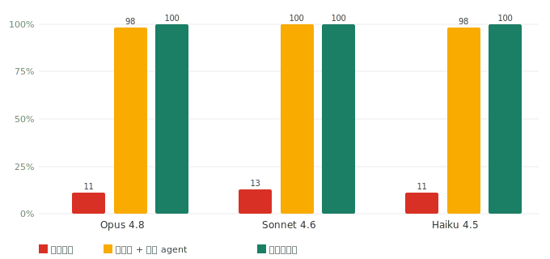
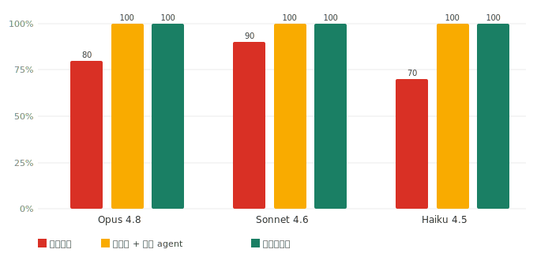

<div align="center">


# 期末极速备考教练

*把你的课件、作业和往年题，变成一位知道出处、记得进度的考前老师。*

中文 · [English](README.md)

[](https://github.com/ZeKaiNie/universal-examprep-skill/stargazers)
[](LICENSE)
[](https://github.com/ZeKaiNie/universal-examprep-skill/actions)

**按你的材料讲课 · 有图题先看图 · 重点题逐步讲 · 进度不会随对话丢失**

</div>

你把课程文件夹交给智能体（例如 Claude Code 或 Codex 里的助手），再告诉它还有几天考试、从哪里开始、用什么语言。选“轻量按需”，它只处理你现在学到的页面；选“完整建库”，它会先整理整门课，再按章节讲。两种方式都会说明公式为什么这样选、数字怎样代入、答案为什么成立。遇到看不清、找不到答案或无法确定的内容，它会把问题列出来请你复核，不会悄悄跳过。

它最重要的特点不是“回答得像老师”，而是让你看得出回答从哪里来：

- 🟢 来自资料：能追到原文件和页码；
- 🟡 AI 补充：材料没有讲全，智能体补充了背景；
- ⚠️ AI 生成答案：不是老师或教材给出的标准答案。

材料撑不起一个结论时，它应该直接说不知道，而不是装作确定。

## 一分钟开始复习

1. [安装这个技能](#安装)。
2. 把讲义、课件、作业、答案、小测和模拟题放进一个材料文件夹。
3. 复制下面这句话发给智能体：

```text
用期末极速备考教练复习 D:\课程资料。我零基础，明天考试，用中文，从第一章开始。先用轻量按需模式。
```

4. 智能体会显示材料路径、学习模式、剩余时间、回复语言和处理方式。确认无误后就开始讲。

想先整理整门课，可以复制这句：

```text
用完整建库处理 D:\课程资料。我零基础，三天后考试，用中文，从第一章开始。
```

建库完成后想得到方便阅读或打印的讲义，可以继续复制这句：

```text
为第一章制作可视化复习讲义和打印版。公式要直接显示，题目只保留相关区域，图片不能缺失。
```

你不必先学会任何命令。下面的命令只给需要排错或自动化的用户。

## 先选哪一种处理方式

第一次使用时，技能会让你在两种方式中选一种。拿不准就选“轻量按需”。

| 方式 | 它会做什么 | 适合谁 | 你要接受的限制 |
|---|---|---|---|
| **轻量按需（默认、推荐）** | 只处理你现在学到的页；看完图后直接在对话里细讲；保存学习进度和笔记 | 明天就考试、材料很多、想尽快开讲的人 | 不提前整理整门课；一次最多处理 8 个主要页面；不生成完整复习讲义或打印版；没有可靠题库时，只能确认内容已经讲过，不能确认你已经掌握 |
| **完整建库** | 先把全课程整理成分章知识库、标准题库和待审清单；之后可制作章节复习讲义 | 材料多而杂、要系统复习、愿意等更久的人 | 首次处理通常更慢、更占磁盘；扫描件、复杂版面、题目与答案配对仍可能需要智能体或人工复核；“处理完成”不等于“所有内容都识别正确” |

轻量按需不会为了省输入而缩短讲解。它省的是“一开始就处理整门课”的成本，不是学生看到的解释。

处理方式和输出方式是两件事：

- 对话教学是默认输出，只在聊天和学习笔记中讲；
- 可视化输出会制作网页讲义，并可进一步生成打印版；
- 轻量按需时，可视化选择只会被记住，不会真的开始制作讲义。要制作讲义，必须明确切到完整建库。

## 它怎样讲你当前在学的内容

每个已经找到的知识点和对应例题都会按下面的顺序讲完。轻量按需只对当前指定页面作这个承诺；完整建库则以已经整理出的全章清单为范围，并把未识别、未配对或仍待复核的内容单独列出来。

1. 用日常语言解释知识点，不假设你已经会术语；
2. 展示这道题真正需要的题面和图片，不把整页其他题一起塞给你；
3. 说清题目问什么、图里能读出哪些量；
4. 解释为什么选这个公式，而不只是把公式贴出来；
5. 逐行代入、计算，并解释每一步；
6. 用初学者能听懂的话说明答案为什么成立；
7. 标出知识点、题目和答案分别来自哪个文件、哪一页。

题面或答案有图时，图片必须先显示出来。缺少必要图片的题不会拿来考你。二叉树、遍历、状态机等题会先用确定的算法算出结果，再画图。

测验只从工作区已有的标准题库抽题，不会把临时编出的题冒充课程测验。错题、跳过的题和“为什么会这样”一类疑问都会记入复习记录。

## 普通功能与延展功能

普通功能已经默认开启，包括轻量按需看图、详细讲题、保存进度和笔记。下面只给延展功能打分。**5 分表示“平台支持就建议开”；4 分表示“需求合适时建议开”；3 分表示“遇到特定问题再开”；1 分表示“通常不要开”。**

| 延展功能 | 建议分 | 默认状态 | 可复制口令 | 固有限制 |
|---|:---:|---|---|---|
| 完整知识库、标准题库、来源冲突检查 | **4/5** | 关闭 | 复制口令 ① | 首次处理较慢；待审问题必须解决或明确列出。明天就考试且只学几页时不建议开 |
| 每轮只讲一道例题 | **4/5** | 关闭 | 复制口令 ② | 很适合零基础，但会更慢；它只改变讲题节奏，不代表已经掌握 |
| 网页复习讲义和打印版 | **4/5** | 关闭 | 复制口令 ③ | 要先裁掉每题周围的无关内容、核对出处，并逐页看成品；耗时并占空间；轻量按需不可用 |
| 用内部独立子智能体逐题写详解 | **5/5** | **只有平台确认具备所需能力时自动开启** | 复制口令 ④ | 只用于第二代完整复习讲义；无法确认“新上下文、限制输入、限制工具”的平台必须走普通详解 |
| 远程高精度 PDF 解析（MinerU / Docling） | **3/5** | 关闭 | 复制口令 ⑤ | 复杂扫描件或混乱版面才值得尝试；本项目绝不在学生电脑上下载或运行它们；结果仍需复核 |
| 远程流程调度（LangGraph） | **1/5** | 关闭 | 复制口令 ⑥ | 通常没必要，因为技能已经有可恢复的学习状态机；它不能代替课程事实和来源记录 |
| 实验性搜索改进 | **1/5** | 试验中，暂不可用 | 复制口令 ⑦ | 目前证据不足；增加的耗时、体积、依赖和误检可能大于收益，所以仍使用现有搜索 |

#### 延展功能复制口令

① 完整建库

```text
请切换到完整建库模式，把整门课整理成分章知识库和标准题库。开始前告诉我预计要处理哪些文件；所有待审、缺图、缺答案和来源冲突都要明确列出，不能静默跳过。
```

② 每轮只讲一道题

```text
从现在开始每轮只讲一道例题。每题都要完整展示题面和所需图片，说明题目问什么、为什么用这个公式、怎样逐步代入，以及答案为什么成立；写入学习笔记后再等我继续。
```

③ 可视化复习讲义和打印版

```text
请在完整建库模式下制作当前章节的可视化复习讲义和打印版。公式必须直接渲染，题目和答案图片只保留当前题相关区域，并逐页检查缺图、错裁、乱码、原始公式代码和无关内容；没有通过检查就不要交付。
```

④ 内部独立子智能体逐题详解

```text
请检查当前平台是否正式支持全新独立上下文，并能把输入和工具限制到单道题。若支持，为复习讲义的每道题默认启用内部独立子智能体详解，只传当前题、已有官方答案、当前题裁剪图、语言和固定讲解要求；不要另配外部接口。若不能确认这些能力，就保持普通详解并明确告诉我。
```

⑤ 远程 MinerU / Docling

```text
这批材料有难处理的扫描页或复杂版面。请先检查当前平台是否已经配置远程 MinerU 或 Docling；不要在本地下载、安装或运行。若远程服务可用，先告诉我服务商、会上传哪些文件、材料保留多久和隐私边界，得到我单独同意后再处理。
```

⑥ 远程 LangGraph

```text
请先说明现有学习状态机为什么不足，以及远程 LangGraph 能解决的具体问题。只有当前平台已经配置远程服务、不会把它当成课程事实源，并且我看完隐私边界后仍明确同意，才启用；不要在本地安装 LangGraph。
```

⑦ 实验性搜索检查

```text
请检查项目是否已有冻结的真实多课程检索测试，并且证明稠密与稀疏混合检索、结果融合和重排在召回率、误检率、稳定性、耗时和体积上都通过门槛。没有完整证据就不要启用，继续使用默认搜索。
```

**直接建议：**先用普通的轻量按需教学。以后制作完整复习讲义时，如果平台确实支持，就保留“内部独立子智能体逐题详解”。时间充足再开完整建库和可视化讲义；只有难处理的扫描页才考虑远程解析；LangGraph 和实验性搜索通常都不要开。

平台不支持某项延展功能时，智能体必须继续使用普通功能并说清限制，不能假装已经运行了远程解析或独立子智能体。

### 逐题独立详解、外部接口和隐私

首选方案是在你当前使用的智能体内部启动一个全新子智能体。每道题只交给它固定讲解要求、当前题目、已有的官方答案、回复语言，以及只包含当前题目的裁剪图；不能把主对话、整门课知识库、其他题目或整个工作区一起塞进去。它不需要另一把接口密钥，但仍会消耗当前平台的模型额度，并受该平台的隐私政策约束。

根据目前的官方说明，Codex、Claude Code、Gemini CLI 和 Antigravity 可以提供适合这项工作的内部子智能体。Cursor 明确提供全新上下文，但子智能体会继承工具，所以只有当前平台还能关闭无关工具时才自动开启。Windsurf 尚未正式说明它有适合这项工作的通用独立子智能体，因此默认关闭；以后能力检查通过再开。

调用另一家外部模型服务只保留为用户明确要求的备用方案，绝不会自动发生。它仍需两次同意：先在本地列出准确题目、图片和调用次数，不上传；再说明当前价格以及服务商怎样保留材料，只允许上传这份准确清单。**不要把接口密钥放进聊天、课程材料、截图、日志或会提交到 Git 的文件。** 详见[可选外部模型适配说明](docs/openai-study-guide-adapter.md)。

## 复习方式、剩余时间和语言

技能会记住下面这些选择，换一个对话也能继续：

| 选择 | 可选值 | 实际影响 |
|---|---|---|
| 从哪里开始 | 零基础从头讲 / 某章起步补弱 / 查缺补漏 | 决定解释深度和从哪一章开始 |
| 还有多久考试 | ≤ 1 天 / 1–3 天 / 3–7 天 / > 7 天 | 决定节奏和复查频率 |
| 回复语言 | 中文 / 英文 / 双语 | 决定智能体自己写出的讲解语言；原材料证据保留原语言 |

“≤ 1 天”会跳过不必要的开场追问，直接开始讲重点；**仍可用标准题库练习或阶段测验验证掌握**。如果你明确说“不要出题、不要问我”，系统只会记录这一章已经讲过，不会假装你已经通过测验。

双语必须明确选择。中文模式不会在每段后面机械附英文，英文模式也不会混入中文；双语模式会为每个完整讲解块提供中英两份内容。

## 安装

只要智能体能使用终端并联网，它通常可以替你完成安装。先复制下面这段发给它；遇到联网或写入系统技能目录时，它可能会请你批准：

```text
请联网获取 https://github.com/ZeKaiNie/universal-examprep-skill 的最新版本，把名为 universal-exam-cram-coach 的技能安装或安全更新到你官方支持的用户级技能目录。优先使用最新发布中的轻量运行包；如果做不到，再克隆仓库。替换旧版前先备份，安装后检查 SKILL.md，告诉我实际安装路径和版本，不要只下载而不加载。
```

下面是各平台可以直接复制的版本。

### Codex

```text
请从 https://github.com/ZeKaiNie/universal-examprep-skill 安装最新版 universal-exam-cram-coach 到我的 Codex 技能目录。替换旧版前先备份。安装后检查 SKILL.md，告诉我实际路径和版本，并说明是否需要新建一个任务才能看到技能。
```

### Claude Code

```text
请把 https://github.com/ZeKaiNie/universal-examprep-skill 安装或更新到 ~/.claude/skills/universal-exam-cram-coach。需要联网、运行终端或写入时向我申请权限；保留已有本地修改，覆盖前先询问。完成后检查 SKILL.md 并告诉我版本。
```

### Cursor

```text
请联网获取 https://github.com/ZeKaiNie/universal-examprep-skill 的最新版，安装为 universal-exam-cram-coach，放到 Cursor 的用户技能目录 ~/.cursor/skills/ 或 ~/.agents/skills/。替换旧版前先备份，完成后确认 Cursor 能发现 SKILL.md，并告诉我实际路径和版本。
```

### Windsurf

```text
请联网获取 https://github.com/ZeKaiNie/universal-examprep-skill 的最新版，安装到 ~/.codeium/windsurf/skills/universal-exam-cram-coach。下载、移动或覆盖文件前向我申请权限，并先备份旧版。完成后确认 Cascade 能发现 SKILL.md，并告诉我版本。
```

### Antigravity

```text
请联网获取 https://github.com/ZeKaiNie/universal-examprep-skill 的最新版，安装到全局技能目录 ~/.gemini/config/skills/universal-exam-cram-coach。需要联网、终端或写入工作区外目录时向我申请权限。安装后重新扫描技能，检查 SKILL.md，并告诉我版本。
```

### Gemini CLI

Gemini CLI 自带从 Git 仓库安装技能的命令：

```bash
gemini skills install https://github.com/ZeKaiNie/universal-examprep-skill.git
```

也可以直接把这段话发给它：

```text
请使用 Gemini CLI 自带的技能安装功能，从 https://github.com/ZeKaiNie/universal-examprep-skill 安装最新版 universal-exam-cram-coach。需要权限时先询问我；安装后重新扫描技能并告诉我版本。
```

### 手动安装和网页版替代

只有智能体不能联网或不能运行终端时，才需要你自己到[最新发布页](https://github.com/ZeKaiNie/universal-examprep-skill/releases/latest)下载 `universal-exam-cram-coach.zip`。完全不能写本地文件的网页版可以复制[网页版中文提示词](prompts/web_prompt.md)，但它不能完整复现长期进度、逐题裁图和可核验讲义。

**课程里有 PDF、公式、图表或大量有图题时，尽量在智能体的桌面软件或编辑器界面里学习，不要只用终端。** 终端适合安装和排错，但通常不如图形界面方便显示本地图片、公式和可点击文件链接。Claude Desktop Code、Codex 桌面版、Cursor、Windsurf 和 Antigravity 更适合作为教材界面。

各平台的官方目录、能力边界和资料链接见[平台兼容说明](docs/agent-portability.md)。

## 你会在学习工作区看到什么

普通学生只需要认识这几项：

| 文件或文件夹 | 用途 |
|---|---|
| `study_state.json` | 真正的学习进度、模式和偏好；不要手改 |
| `study_progress.md` | 给人看的进度摘要，由脚本生成 |
| `notebook/` | 已讲内容、错题和每章复习笔记 |
| `references/wiki/` | 完整建库后生成的分章知识库 |
| `references/quiz_bank.json` | 有来源记录的标准题库 |
| `.ingest/` | 完整建库的解析记录、待审问题和来源证明；主要给智能体和审计工具使用 |
| `.lightweight/` | 轻量按需模式当前页面的图片与处理记录 |

详细文件约定见[工作区文件说明](docs/file-format.md)。

## 实测数据

技能的价值是让回答**有据可查**：把材料里有、但模型原本不知道的内容接上去，同时让没有依据的答案显形。下面数字只代表表中课程、模型和题集的实测结果，不保证所有学科和平台都能得到相同结果（判分模型：Sonnet）。

**① 这些实测中的材料专属题正确率明显提高。** 教授的例子、冷门研究、具体数字等细节，很难只靠通用知识答对：

<div align="center"></div>

| 课程 · 模型 | 闭卷 | 原文件 + 通用智能体 | 使用本技能 |
|---|:---:|:---:|:---:|
| PSYC 110 · Opus 4.8 | 11% | 98% | **100%** |
| PSYC 110 · Sonnet 4.6 | 13% | 100% | **100%** |
| PSYC 110 · Haiku 4.5 | 11% | 98% | **100%** |
| 6.006 · Haiku 4.5 | 45% | 89% | **91%** |

**② 这组越界题实测的如实弃答率为 100%。** 在所测两门课、三个模型的题目中，技能组和原文件组对全部材料范围外问题都选择弃答；闭卷组测得 60%–90%。样本设计与局限见完整报告。

<div align="center"></div>

在这些实测中，分章检索与直接读取原文件的精度接近，每题成本如下。它只取相关章节，不是每道题都重新翻完整堆材料：

<details><summary>每题成本</summary>

| 每题成本 | 闭卷 | 原文件智能体 | 使用本技能 |
|---|:---:|:---:|:---:|
| PSYC 110 | $0.033 | $0.117 | **$0.102** |
| 6.006 | $0.034 | $0.066 | **$0.063** |

</details>

完整方法、三组对照、判分校准、费用和局限 → **[实测报告](benchmark/REPORT.md)**。实测文件从未被仓库删除；v4.3 改写 README 时只是误删了这里的详细展示。

## 常见问题

**为什么第一章没有图片？** 先检查题面图是否真正显示，而不是只输出了文件路径。然后让智能体运行只读审计，列出哪些原页有图、哪些题缺图、还有哪些问题没处理。缺图时不能声称本章已经完整。

**为什么公式还是 `$...$` 这样的原始公式代码（LaTeX）？** 对话里应把公式拆成通俗语言解释；可视化复习讲义必须把公式渲染成人能直接阅读的形式。原始公式字符串可以作为机器记录保留，但不能作为最终教材的唯一展示。

**只有扫描件或照片怎么办？** 轻量按需可直接看当前图片或渲染后的 PDF 页面。完整建库会把识别不稳的页面放进待审清单，而不是静默跳过。录音仍需先转成文字。

**没有 Python 怎么办？** 只有确认 Python 程序真的无法启动时，才使用能力较弱的手工方式。某条脚本报错不等于电脑没有 Python，应先修复或明确报告实际错误。

**一道题太难，能跳过吗？** 可以。说“跳过”或“这题不会”，它会把题记入错题记录，继续往下，并在复盘时重新出现。

**怎样审查一个已经生成的工作区？** 使用 [`skills/exam-audit/`](skills/exam-audit/) 做只读检查。它会列出材料版本、缺图、待审问题、题库和学习状态是否一致，不会默认修改文件。

## 给开发者和维护者

根 [`SKILL.md`](SKILL.md) 负责入口路由；共享行为规则位于 [`skills/`](skills/)；中英文兼容入口位于 [`locales/`](locales/)。十个子技能中包括授课、建库、测验、错题复盘、复习讲义、速记小抄、审计和 [`skills/confusion-tracker`](skills/confusion-tracker/SKILL.md) 疑难追踪。

内部状态约定：用户明确要求“不出题、不提问”时保存 `no_questions=true`；因此章节完成状态最多为 `covered_unverified`。这些名称只供脚本、测试和维护者使用，学生不需要手动设置。

常用检查：

```bash
python -m unittest discover -s tests -v
python scripts/validate_workspace.py path/to/workspace
python scripts/build_dist.py
```

架构和边界见[技能架构](docs/skill-architecture.md)、[平台兼容说明](docs/agent-portability.md)、[PDF 能力适配](docs/pdf-capability-adapters.md)和[语言规则](docs/language-policy.md)。历史版本只记录在 [`CHANGELOG.md`](CHANGELOG.md)。

## 开源协议

[MIT](LICENSE)。欢迎提交新的学科模板、解析适配和真实课程回归样本。祝你复习顺利。🎓

<div align="center">

<a href="https://www.star-history.com/?repos=ZeKaiNie%2Funiversal-examprep-skill&type=date&legend=top-left">
 <picture>
   <source media="(prefers-color-scheme: dark)" srcset="https://api.star-history.com/chart?repos=ZeKaiNie/universal-examprep-skill&type=date&theme=dark&legend=top-left&sealed_token=q2eC20GmpWMHMen634RnHHNopx3dtYK6mzpbK0tB8B7sBn_LT0IKz-TYsaaWMY5xLJ6i7bsHedSzBxs4DU6cD5vZ8HFc-ZD2XAlqm5MnqBbf-ZbEq8zr2A" />
   <source media="(prefers-color-scheme: light)" srcset="https://api.star-history.com/chart?repos=ZeKaiNie/universal-examprep-skill&type=date&legend=top-left&sealed_token=q2eC20GmpWMHMen634RnHHNopx3dtYK6mzpbK0tB8B7sBn_LT0IKz-TYsaaWMY5xLJ6i7bsHedSzBxs4DU6cD5vZ8HFc-ZD2XAlqm5MnqBbf-ZbEq8zr2A" />
   
 </picture>
</a>

</div>
