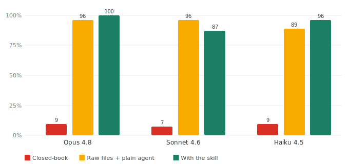
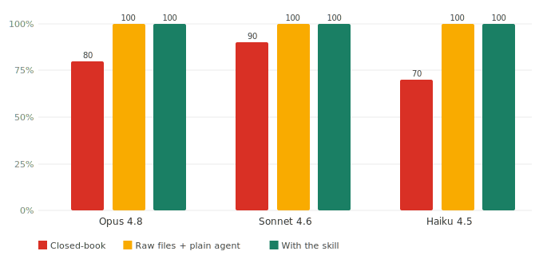
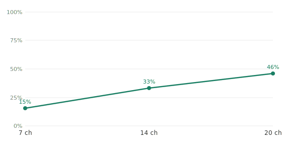

# A hallucination benchmark: the skill takes 11% to ~99%

[中文](REPORT.md) · English

*July 2026 · ~6 min*

We measure one specific thing: give a model the same question and **only change whether it gets the course materials** — how do correctness and fabrication move? Three conditions — closed-book (nothing), raw files (drop the lecture files in a folder, generic agent retrieves), and with this skill (lectures sliced into a chaptered knowledge base, pulled on demand). All judging is by Sonnet: factual answers first try a verbatim gold match, falling to per-claim checking only if that misses.

The skill's value is **grounding** — connecting what's in your materials but not in the model's head, accurately, and never fabricated. Two real measurements make the case.

---

## In your materials, not in the model: from 11% to ~99%

Earlier versions mined our own questions from the lectures, fairly criticized as not rigorous, so this version targets details **only someone who watched that lecture would know**: from the 20 Yale PSYC 110 lecture transcripts we mined 54 questions — the professor's own examples, personal asides, obscure studies he named, exact numbers (his childhood phone number, ~30 billion cerebellar neurons, a study's 92%), each answer **anchored verbatim to the transcript**. World knowledge can't answer these.

*54 materials-specific questions, judge Sonnet. All three models collapse to **11%** closed-book; hand the materials back (raw files or skill) and correctness returns to **94%–100%**.*

Same model, same question — **just changing whether it gets the materials moves correctness from 11% to ~99%**. That's the point of the skill: when the answer is in your materials but not the model's head, it connects the materials **accurately**. The self-mined 6.006 set shows the same pattern (closed-book 31%–58% → skill 87%–91%).

The skill matches a "raw files agent" on accuracy but costs less — it pulls only the compressed relevant chapters, while raw files re-scans the whole pile each question ($0.10 vs $0.117 per question on PSYC, $0.063 vs $0.066 on 6.006) — and helps weaker models most.

---

## Not in the materials at all: the skill says "not covered" 100% of the time

Every set seeds **out-of-scope probes** — questions the materials genuinely don't answer (e.g. "how many students enrolled in this course"). The right behavior is to abstain; fabricating is a hallucination.

*Honest-abstention rate on out-of-scope probes, higher is better. With the skill (and raw files), **100% across both courses and all three models**; closed-book only 60%–90% (it fabricates a plausible answer).*

This is the skill's most consistent result and the clearest anti-hallucination measure: **faced with a question the materials don't answer, it says "not in the materials" 100% of the time — never fabricates**; closed-book models fabricate a plausible answer 10%–40% of the time.

---

## Correctness rises with knowledge-base coverage

The skill's correctness is driven by coverage. Growing the 6.006 knowledge base from 7 chapters to 14 to 20 raises correctness from 28% to 62% to 87% — monotonic.

*Knowledge base 7 → 14 → 20 chapters, correctness 28% → 62% → 87%. Coverage is the driver.*

---

## How we judged (and a bug we fixed)

Judging is by Sonnet: numeric questions by exact programmatic comparison; factual questions first by `contains_gold` verbatim match, falling to per-claim checking only if that misses.

Doing this run we found the judge was **too strict**: a correct answer that **wrapped the gold in markdown** (`**"a donkey and a big bag of peanuts"**`) or **added correct context** was missed by the verbatim match and then marked wrong as "a claim beyond the evidence." Fix: strip markdown/quotes before matching, and tell the judge explicitly that "extra correct detail doesn't change correctness." After **re-judging every answer uniformly**, Sonnet's skill arm went from 87% back to 98% (it had been mis-marked down) — consistent with human calibration: in both human spot-checks (16-item kappa = 0.875, 24-item stratified blind kappa = 0.833) every disagreement was the judge being too strict, so the numbers lean conservative, not inflated.

---

## Why these three arms

- **Closed-book** — no materials, exposes the model's prior-knowledge floor.
- **Raw files + generic agent** — drop the raw lectures in a folder, the model retrieves, **without this skill**. The fairest control — "why not just drop a folder at the AI?"
- **With the skill** — lectures organized into a chaptered knowledge base, chapters pulled lazily.

Raw files is already strong, so the skill wins on "same accuracy for less cost + more help to weaker models + never fabricates," not by blowing it away — reported as-is.

---

## Limitations

- **The skill measures grounding** (content specific to your materials), not the generic knowledge a model already has cold — on that kind of question the model is fine closed-book, and the skill isn't where its value lies.
- **Small sample**: 54 materials-specific PSYC questions, 65 for 6.006; 10 out-of-scope probes per course. Trend evidence, not large-scale statistics.
- **Materials-specific gold held locally** (verbatim transcript quotes, to avoid copyright/leakage); reproducible by holders via `run_matrix.py --real`.
- **The Sonnet judge shares a family with the graded models** — both human kappa passes were high, but a known limitation; a cross-provider GPT comparison is in progress (limited by the other account's quota).

Full commands and reproduction in [`docs/running-real-runs.md`](docs/running-real-runs.md); metrics are benchmarked against FACTS Grounding, Vectara HHEM, RAGAS, RGB (see [`docs/`](docs/)).
