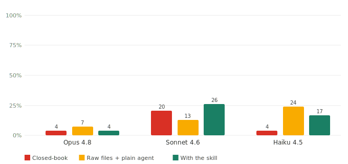
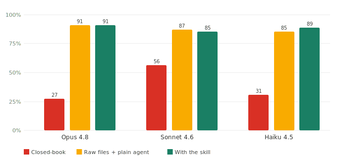

# Anti-hallucination benchmark: after we made the test harder

[中文](REPORT.md) · English

*July 2026 · ~6 min*

We measure one specific thing: give a model the same question and **only change whether it gets the course materials** — how do correctness and hallucination move? Three conditions — closed-book (nothing), raw files (drop the lecture files in a folder, let a generic agent retrieve), and with this skill (slice the lectures into a chaptered wiki, pull on demand).

The first version's result was weak — not because the skill doesn't help, but because **the test was too easy**. Here's how we found that, how we made the test harder, and what we measured after.

---

## The test was too easy

The first PSYC 110 set had 50 questions; closed-book correctness was 55%–60%. The problem was the questions: "which Nobel biologist described the 'Astonishing Hypothesis'" (Francis Crick), "what aphasia did Broca discover in 1861" — textbook trivia a model **answers without ever seeing the lecture**. The "with vs. without materials" gap got flattened, and the skill's value was understated.

The fix was to mine only questions the model can't answer from priors. We had 5 agents read all 20 lecture transcripts and pick out details "only someone who watched this lecture would know" — the professor's own examples, personal asides, obscure studies he named in passing, exact numbers. Each answer is **anchored verbatim to a span of the transcript**, script-verified to actually appear in that lecture (any non-verbatim span dropped on the spot). That yields 54 questions:

> *What was Bloom's childhood phone number (with area code)?* → `514-688-9057`
> *Roughly how many neurons does the cerebellum contain?* → `about 30 billion`
> *In the Pratfall-effect study, what percent did the "near-perfect" contestant get right?* → `92%`

*54 questions, all drawn from the 20 Yale OCW PSYC 110 transcripts, each answer anchored verbatim to its lecture. Unanswerable from world knowledge, checkable in the transcript.*

---

## Closed-book collapses

Running the closed-book arm across three models, we saw correctness fall from the old set's 55%–77% to **single digits**: Opus 9%, Sonnet 7%, Haiku 9%. Even Opus is at 9% — these questions genuinely can't be guessed.

At the single-item level, closed-book failure looks like this:

> **Q:** What was Bloom's childhood phone number?
> **Closed-book:** *"He never stated a specific number in the lectures."* — fabricated (he did: 514-688-9057)
> **With the skill:** *"514-688-9057 (his maintenance-rehearsal example in Lecture 8)."* — 🟢 from the materials

*Closed-book (red) vs with the skill (green), 54 questions, judge Sonnet (out-of-scope probes excluded from this figure). All three models' closed-book bars sit at 7%–9% — the floor we wanted.*

A floor near zero is what lets us cleanly measure how much "give the materials" adds.

---

## Give the materials back, correctness returns to ~90%

Same 54 questions, materials handed back, correctness jumps to around 90%:

| Model | Closed-book | Raw files + generic agent | With the skill | Gain (closed→skill) |
|---|:--:|:--:|:--:|:--:|
| Opus 4.8 | 9% | 96% | **100%** | +91 |
| Sonnet 4.6 | 7% | 96% | 87% | +80 |
| Haiku 4.5 | 9% | 89% | **96%** | +87 |

An 80–91 point grounding gap, and independent of model strength — even Opus can't produce Bloom's childhood phone number without the materials. The skill matches the "raw files agent" on accuracy but costs less: it pulls only the compressed relevant chapters, while the raw-files agent re-scans the whole file pile each question.

Sonnet has an anomaly: with the skill (87%) it's below raw files (96%). The hallucination rate explains it:

*Claim-level hallucination rate, same 54 questions. Sonnet runs high across all arms (closed-book 20% / skill 26%); Opus and Haiku much lower.*

Sonnet elaborates more, and gets penalized by the strict per-claim scoring — this is not self-preference (Sonnet is both a graded model and the judge; self-judging would inflate, not deflate). Measured as-is, not tidied up.

---

## A different course, same pattern

Then MIT 6.006 Algorithms — a math-heavy STEM course, graded by exact numeric comparison (no LLM judge). 65 questions drawn from 20 OCW lectures and problem sets, each answer anchored verbatim. 6.006 is already hard closed-book; the three models land at 27%–56% (Sonnet leans on CS priors more), and all return to 85%–91% once the materials are back:

*MIT 6.006, 65 questions, three models, numeric questions graded deterministically. Closed-book 27%–56% → with the skill 85%–91%.*

One course tests humanities fact recall, one tests algorithm reasoning — two unrelated domains, **one curve**: closed-book low, correctness rises with materials, skill ≥ raw files ≥ closed-book. Closed-book also hallucinates most (6.006 closed-book fabricates algorithm details it doesn't know).

---

## Correctness rises monotonically with wiki coverage

The skill's correctness is driven by wiki coverage, not something else. Growing the 6.006 wiki from 7 chapters to 14 to 20 raises correctness from 28% to 62% to 87%.

*Wiki 7 → 14 → 20 chapters, correctness 28% → 62% → 87%. Monotonic — coverage is the driver.*

---

## How we judged

Judging is by Sonnet, on two paths: numeric questions (complexity, counts) go through exact programmatic comparison within a tolerance, no model call; factual questions first try a `contains_gold` word-boundary match (gold appears verbatim → correct), and only fall to the judge for claim-level entailment (decompose the answer into claims, check each against the supporting span). Unanswerable questions: honest abstention counts correct, fabricating counts a hallucination.

The judging itself is human-calibrated twice: an early 16-item spot check gave Cohen's kappa = 0.875; then a 24-item stratified blind pass (answerable-correct/wrong + out-of-scope abstained/not, judge hidden) gave 91.7% agreement, kappa = 0.833 — both high, mutually corroborating. Every human–judge disagreement in both passes was the **judge being too strict** (marking a correct answer wrong), which means the numbers above lean conservative, not inflated.

---

## Why these three arms

- **Closed-book** — no materials, exposes the model's prior-knowledge floor. It's the floor.
- **Raw files + generic agent** — drop the raw lectures/problems in a folder, the model retrieves with generic Read/Glob/Grep, **without this skill**. The fairest control — it directly answers "why not just drop a folder at the AI?"
- **With the skill** — lectures organized into a chaptered wiki, chapters pulled lazily at answer time.

Raw files is already strong, so the skill wins on "same accuracy for less cost + more help to weaker models", not by blowing it away — reported as-is.

---

## Limitations

- **Small sample** — 54 hard PSYC 110 questions, 65 for 6.006. Trend evidence, not large-scale statistics.
- **Hard-set gold held privately** — the 54 hard questions quote transcript verbatim; to avoid copyright and answer leakage they're not in the public repo (same posture as the published matrix — publish numbers, not the private gold); the numbers reproduce with `run_matrix.py --real` for anyone holding the gold.
- **Same-family judge** — the Sonnet judge shares a family with the graded models; both human kappa passes were high, but it remains a known limitation. Sonnet's generation arm is self-judged (Opus/Haiku arms are not).
- **Strict hallucination scoring** — per-claim judging counts a "correct answer that adds correct detail beyond the supporting span" as a hallucination too, so the skill arm reads high on that metric; it does not mean more fabrication. The real fabrication metric is out-of-scope abstention — 100% for the skill arm.

Metrics are benchmarked against public hallucination suites (FACTS Grounding, Vectara HHEM, RAGAS, RGB); see [`docs/`](docs/). Full commands and reproduction: [`docs/running-real-runs.md`](docs/running-real-runs.md).
