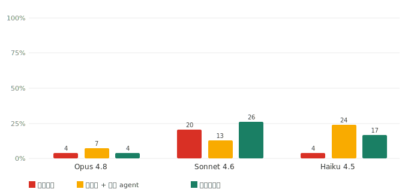
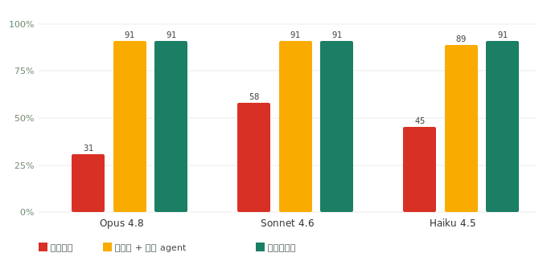

# 防幻觉 benchmark：把题目变难之后

中文 · [English](REPORT.en.md)

*2026 年 7 月 · 约 6 分钟*

我们测的是一件很具体的事：给同一个模型同一道题，**只改「给不给它课程材料」**，正确率和瞎编率怎么变。三种条件——闭卷（什么都不给）、裸文件（把原始讲义丢进文件夹让通用 agent 自己检索）、装上本技能（先把讲义切成分章 wiki 再按需取）。

第一版结果偏弱，不是因为技能没用，而是因为**题目太容易**。下面讲我们怎么发现的、怎么把题目变难、变难之后测到了什么。

---

## 题目太容易了

第一版 PSYC 110 用了 50 道题，闭卷正确率 55%–60%。问题出在题面：「描述『惊人假说』的诺奖生物学家是谁」（Francis Crick）、「Broca 1861 年发现的失语症叫什么」——这些是教科书级常识，模型**不看讲义也答得出**。「给材料 vs 不给」的差距被压扁，技能的价值被低估。

改法是只挖模型先验答不出的题。我们让 5 个 agent 分读 20 讲全转录，专挑「只有看过这节课才知道」的细节——教授本人举的例子、私人轶事、顺口点名的冷门研究、具体数字。每道题的标准答案都从转录里**逐字锚定一段原文**，并用脚本校验这段原文确实出现在对应讲次（一条不逐字的当场剔除）。最终得到 54 道题：

> *Bloom 小时候的电话号码（含区号）是多少？* → `514-688-9057`
> *小脑大约有多少个神经元？* → `约 300 亿`
> *Pratfall 效应实验里，那个「近乎完美」的选手答对了百分之几的题？* → `92%`

*54 题，均取自 Yale OCW PSYC 110 的 20 讲转录，标准答案逐字锚定讲次原文。世界知识答不出，转录里可查。*

---

## 闭卷全崩

跑完三个模型的闭卷臂，我们观察到正确率从旧题的 55%–77% 掉到**个位数**：Opus 9%、Sonnet 7%、Haiku 9%。连 Opus 都只有 9%——这些题确实无法靠先验猜。

具体到单题，闭卷臂的失败长这样：

> **问：** Bloom 小时候的电话号码是多少？
> **闭卷：** *「他没有在讲座里公开过具体号码。」* —— 编造（他公开过：514-688-9057）
> **装上技能：** *「514-688-9057（Lecture 8 维持性复述的例子）。」* —— 🟢 来自资料

*闭卷（红）vs 装上技能（绿），54 题，判分 Sonnet（越界探针不计入此图）。三模型闭卷都趴在 7%–9%——这就是我们要的地板。*

正确率接近 0 的地板，才能干净地量出「给材料」到底加了多少。

---

## 给回材料，正确率回到九成

同样 54 道题，把材料给回去，正确率立刻回到九成上下：

| 模型 | 闭卷 | 裸文件 + 通用 agent | 装上技能 | 提升（闭卷→技能） |
|---|:--:|:--:|:--:|:--:|
| Opus 4.8 | 9% | 96% | **100%** | +91 |
| Sonnet 4.6 | 7% | 96% | 87% | +80 |
| Haiku 4.5 | 9% | 89% | **96%** | +87 |

grounding 差距 80–91 个百分点，且与模型强弱无关——再强的 Opus，不给材料也答不出 Bloom 小时候的电话号码。技能和「裸文件 agent」精度接近，但成本更低：它只取压缩过的相关章节，裸文件 agent 每题都要翻检整堆原始文件。

Sonnet 那一栏有个反常：技能 87% 反而低于裸文件 96%。看瞎编率能解释：

*逐句瞎编率，同 54 题。Sonnet 三臂都偏高（闭卷 20% / 技能 26%），Opus/Haiku 低得多。*

Sonnet 更爱展开作答，被逐句严格判分惩罚——这不是自判偏好（Sonnet 既是被测生成模型、也是裁判，自判只会抬高不会压低）。如实测出来的，不修饰。

---

## 换一门课，同样的模式

再跑 MIT 6.006 算法——一门数学密集的理工课，判分用确定性数值比对（不靠 LLM 裁判）。65 题抽自 20 讲 OCW 讲义与习题，标准答案逐字锚定出处。三个模型闭卷 27%–56%（Sonnet 靠 CS 先验答得多些），给回材料都回到 85%–91%：

*MIT 6.006，65 题，三模型，数值题走确定性比对。闭卷 27%–56% → 装上技能 85%–91%。*

一门考人文事实召回、一门考算法推导，两个毫不相干的领域，**同一条曲线**：闭卷低、给材料就上来、skill ≥ rawfiles ≥ closedbook。闭卷的瞎编率也最高（6.006 闭卷 31%——它在编自己不知道的算法细节）。

---

## 正确率随知识库覆盖度单调上升

技能的正确率是被知识库覆盖度驱动的，不是别的因素。把 6.006 的 wiki 从 7 章逐步补到 14 章、20 章，正确率随之从 28% 升到 62%、再到 87%。

*知识库 7 → 14 → 20 章，正确率 28% → 62% → 87%。单调上升——是覆盖度在驱动，不是别的。*

---

## 怎么判分的

判分由 Sonnet 完成，分两条路：数值题（复杂度、个数）走程序精确比对，误差容限内即对，不调模型；事实题先做 `contains_gold` 词边界快速匹配（标准答案逐字出现即对），匹配不上才让裁判做 claim 级蕴含判定（把回答拆成小句，逐句对照支撑原文）。资料里没有答案的题：如实弃答算对，硬编算一次瞎编。

判分本身经过两次人工校准：早先 16 题抽查 Cohen's kappa = 0.875；随后 24 题分层盲测（可答判对/判错 + 越界弃答/未弃答四层，判分对人隐藏），一致率 91.7%、kappa = 0.833——都属高度一致，互相印证。两次里所有人机分歧**都是判分偏严**（把正确答案判错），说明上面的数字更可能偏保守而非虚高。

---

## 三臂为什么这么设

- **闭卷**：不给任何材料，暴露模型先验知识底噪。它是地板。
- **裸文件 + 通用 agent**：把原始讲义/习题丢进文件夹，模型用通用的 Read/Glob/Grep 按需检索，**但不用本技能**。这是最公平的对照——直接回答「丢个文件夹给 AI 自己读不就行了，还要技能干嘛」。
- **装上技能**：先把讲义整理成分章 wiki，答题时惰性取相关章节。

裸文件本身就很强，所以技能靠「同精度更省 + 对弱模型帮助更大」赢，而不是靠碾压——我们如实这么报。

---

## 局限

- **样本有限**：PSYC 110 难题集 54 道、6.006 共 65 道。是趋势证据，不是大规模统计。
- **难题金标本地保留**：54 道难题逐字引用了讲义转录，为避免版权与泄题不进公开仓库（与已发布矩阵同口径——发布数字、不发布私有金标）；数字可由持有金标者用 `run_matrix.py --real` 复现。
- **判分同家族**：裁判 Sonnet 与被测模型同属一个家族，虽两次人工 kappa 校准均高度一致，仍是已知局限。Sonnet 生成臂为自判（opus/haiku 臂非自判）。
- **瞎编率口径严**：逐句判定会把「答案正确、但补充了支撑段落之外的正确细节」也算一次瞎编，因此技能臂这项数值偏高，不代表凭空捏造增多。真正衡量凭空捏造的是越界弃答率，技能臂 100%。

各项指标对标 FACTS Grounding、Vectara HHEM、RAGAS、RGB 等公开幻觉基准，详见 [`docs/`](docs/)。完整命令与复现步骤见 [`docs/running-real-runs.md`](docs/running-real-runs.md)。
