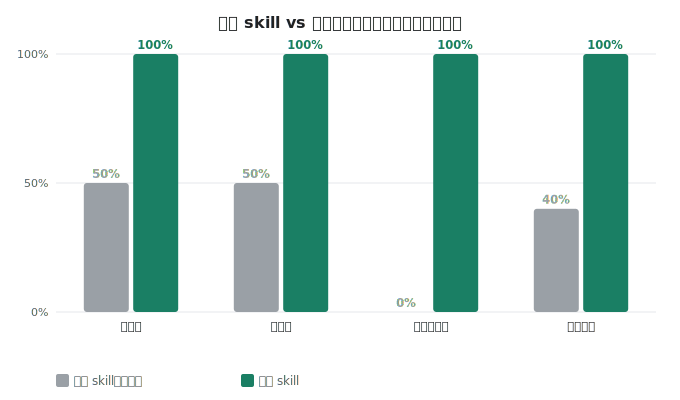
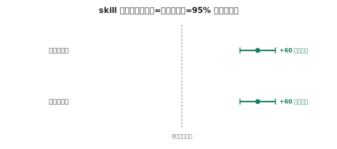

# 防幻觉实测报告 / Hallucination Benchmark

> 完整可视化、中英双语、带引用的版本见 `report.html`（用浏览器打开）。

## 数字 / Numbers
| 指标 Metric | 没装 skill | 装了 skill | 依据 Basis |
| :-- | :--: | :--: | :-- |
| 忠实度 Faithfulness | 87% | 97% | [RAGAS faithfulness](https://arxiv.org/abs/2309.15217), [FACTS Grounding](https://arxiv.org/abs/2501.03200) |
| 幻觉率 Hallucination rate | 8% | 8% | [Vectara HHEM](https://github.com/vectara/hallucination-leaderboard), [HalluLens](https://arxiv.org/abs/2504.17550) |
| 正确率 Correctness | 90% | 100% | [TRUE (NAACL 2022)](https://arxiv.org/abs/2204.04991) |
| 计算题准确率 Numeric accuracy | 50% | 100% | 确定性判分 |
| 越界弃答率 Abstention (out-of-scope) | 100% | 100% | [RGB negative rejection](https://arxiv.org/abs/2309.01431), [SimpleQA abstention](https://arxiv.org/abs/2411.04368) |

n=13；McNemar p=1.000；幻觉率差值 95% CI [+0, +0] 个百分点。题量偏小，暂未达显著，按趋势看待、不夸大。

## 参考基准 / References
- [FACTS Grounding (Google DeepMind, 2025)](https://arxiv.org/abs/2501.03200) — 仅依据给定文档作答的有据性基准——与本测试最贴合。
- [Vectara HHEM Hallucination Leaderboard](https://github.com/vectara/hallucination-leaderboard) — “只据原文”的幻觉率，附开源分类器 HHEM-2.1。
- [RAGAS: Faithfulness (Es et al., 2023)](https://arxiv.org/abs/2309.15217) — 忠实度 = 答案被上下文支持的论断占比。
- [RGB: Retrieval-Augmented Generation Benchmark (Chen et al., AAAI 2024)](https://arxiv.org/abs/2309.01431) — 负向拒答 / 弃答能力。
- [HalluLens (Bang et al., ACL 2025)](https://arxiv.org/abs/2504.17550) — intrinsic / extrinsic 幻觉分类法。
- [TRUE: Factual Consistency Evaluation (Honovich et al., NAACL 2022)](https://arxiv.org/abs/2204.04991) — 忠于来源的事实一致性度量（NLI）。
- [SimpleQA (Wei et al., OpenAI 2024)](https://arxiv.org/abs/2411.04368) — 弃答与置信度校准评测协议。
